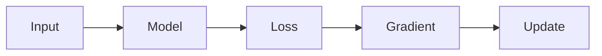

# Copilot Instructions — DeeplearingClassNotes

## Repository Overview

This repository contains notes and exam answers for a 24-session deep learning course.
Sessions cover: PyTorch fundamentals, perceptrons, MLPs, backpropagation, regularisation,
CNNs, RNNs, LSTMs, GRUs, Seq2Seq, attention mechanisms, and Transformers.

---

## Source of Truth

When generating or updating answer files, use **`latex_merged/`** as the primary content source.
These 10 merged LaTeX documents cover all sessions and contain authoritative definitions,
equations, and derivations.

Map topics to files:

| Topic | File(s) |
|---|---|
| Intro, PyTorch, tensors | `latex_merged/01_introduction_and_pytorch_foundations.tex` |
| Perceptron, MLP, activation functions | `latex_merged/02_perceptron_and_mlp.tex` |
| Backprop, chain rule, gradient flow | `latex_merged/03_neural_networks_and_backpropagation.tex` |
| Deep networks, vanishing gradients | `latex_merged/04_deep_networks_vanishing_gradients_and_assessment.tex` |
| Regularisation, Dropout, BatchNorm | `latex_merged/05_ann_hands_on_and_regularisation.tex` |
| CNN, convolution, pooling, parameter sharing | `latex_merged/06_convolutional_neural_networks.tex` |
| RNN, BPTT, vanishing gradient in sequences | `latex_merged/07_recurrent_neural_networks.tex` |
| LSTM, forget/input/output gates | `latex_merged/08_lstm_theory_and_practice.tex` |
| GRU, Seq2Seq, BiRNN | `latex_merged/09_gru_seq2seq_and_birnn.tex` |
| Attention mechanism, Transformers | `latex_merged/10_attention_mechanism_and_transformers.tex` |

Do **not** use `transcripts/` or `ai_systems_lab_transcripts/` as primary sources —
these are raw session recordings and may contain informal or imprecise language.

---

## Output Format

- Always output **GitHub-flavoured markdown** (`.md`).
- Never output LaTeX for answer files.
- Follow the Section A / B / C structure with mark allocations as in existing answer files.

### Answer Structure Template

```
## Section A (4 Marks)
### A1. <Topic> [2]
### A2. <Topic> [2]

## Section B (6 Marks)
### B1. <Topic> [3]
### B2. <Topic> [3]

## Section C (10 Marks)
### C1. <Topic> [5]
### C2. <Topic> [5]
```

---

## Diagram Strategy — Priority Order

For every architecture or concept diagram, follow this waterfall. Stop at the first option that works.

### Priority 1 — Embed a real image from the web (BEST)

Search the web for a canonical, well-known diagram of the architecture by name and original author/paper.
If a stable, publicly accessible image URL exists (Wikipedia, papers with code, original paper figures,
Wikimedia Commons, CS231n, D2L.ai, distill.pub, etc.), embed it directly:

```

*Source: LeCun et al. (1998) — LeNet architecture*
```

**Known canonical image sources to search first:**

| Architecture | Search query / known source |
|---|---|
| CNN (LeNet) | "LeNet architecture diagram Wikimedia" or LeCun 1998 figure |
| CNN (general) | CS231n Stanford — "typical CNN architecture" |
| LSTM cell | "LSTM cell diagram Wikimedia" / Colah's blog (colah.github.io) |
| GRU cell | "GRU diagram" — Cho et al. 2014 / Wikimedia |
| Transformer | "Transformer architecture Vaswani 2017" — original paper Fig 1, or d2l.ai |
| Attention mechanism | Bahdanau 2014 / distill.pub "attention" |
| Encoder-Decoder | Sutskever 2014 seq2seq figure |
| ResNet | He et al. 2015 residual block figure |
| Backpropagation | CS231n backprop diagram |
| Perceptron / MLP | Wikimedia "multilayer perceptron" |

Rules for embedded images:
- Prefer Wikimedia Commons, CS231n, D2L.ai, distill.pub — these have stable permanent URLs.
- Always add a caption with `*Source: Author (Year)*` for attribution.
- Use `` syntax — GitHub renders these natively.
- Do NOT hotlink from arxiv PDF pages or personal websites that may go offline.

---

### Priority 2 — Hyperlink to a canonical diagram page

If a stable embeddable image URL cannot be confirmed, provide a descriptive hyperlink instead:

```
**Architecture diagram**: [Transformer — Vaswani et al. 2017, Figure 1](https://arxiv.org/abs/1706.03762)

**Interactive explainer**: [The Illustrated Transformer — Jay Alammar](https://jalammar.github.io/illustrated-transformer/)
```

**Known canonical reference pages:**

| Architecture | Reference |
|---|---|
| Transformer | https://arxiv.org/abs/1706.03762 (Vaswani et al.) |
| Transformer (visual) | https://jalammar.github.io/illustrated-transformer/ |
| LSTM | https://colah.github.io/posts/2015-08-Understanding-LSTMs/ |
| GRU | https://colah.github.io/posts/2015-08-Understanding-LSTMs/ |
| CNN | https://cs231n.github.io/convolutional-networks/ |
| Attention | https://distill.pub/2016/augmented-rnns/ |
| Backpropagation | https://cs231n.github.io/optimization-2/ |

---

### Priority 3 — Mermaid flowchart (simple flows only)

Use Mermaid **only** when the diagram is a simple linear/branching flow with fewer than ~8 nodes.
Mermaid renders well on GitHub for: training loops, forward/backward pass, supervised vs unsupervised,
loss computation pipelines, and simple decision flows.



**Mermaid — hard rules (violations cause "Diagram syntax error" on GitHub):**
- No cycle arrows: `A --> B --> A` patterns will fail
- No `classDef` + `:::` syntax — not supported in GitHub's Mermaid version
- No long Unicode math in node labels (e.g. `∂ℒ/∂W²`) — use plain short text
- Max ~8 nodes before layout breaks; for larger graphs use Priority 1 or 2

**When to use Mermaid:**
- Training loop, forward pass, backprop flow: OK
- Supervised vs unsupervised comparison: OK
- Transformer encoder/decoder with subgraphs: OK (tested and works)
- CNN layer stack, LSTM cell, RNN unroll: NOT OK — use Priority 1 or 2

---

### Priority 4 — ASCII art (LAST RESORT only)

Use ASCII art **only** when all of the above have failed or are unavailable (e.g. offline/air-gapped
environment, no web access). ASCII is always readable but least visually informative.

```
Input (28x28x1)
      |
  Conv2D-32 (3x3, ReLU)   ->  320 params
      |
  MaxPool (2x2)            ->    0 params
      |
  Flatten -> Dense-128 (ReLU) -> Dense-10 (Softmax)
```

---

## Math Rules

- **Inline math**: `$...$`
- **Block math**: `$$...$$`
- Always show parameter calculations in three steps:

```
formula  ->  substitute values  ->  numeric result
```

Example:

$$\text{params} = (k \times k \times C_{in} + 1) \times C_{out} = (3 \times 3 \times 1 + 1) \times 32 = 320$$

---

## Parameter Calculation Convention

For every layer in a CNN/MLP answer, include a table with an explicit formula column:

| Layer | Formula | Params |
|---|---|---|
| Conv2D(1->32, 3x3) | $(3\times3\times1+1)\times32$ | 320 |
| Conv2D(32->64, 3x3) | $(3\times3\times32+1)\times64$ | 18,496 |
| Dense(576->128) | $576\times128+128$ | 73,856 |
| Dense(128->10) | $128\times10+10$ | 1,290 |
| **Total** | | **93,962** |
