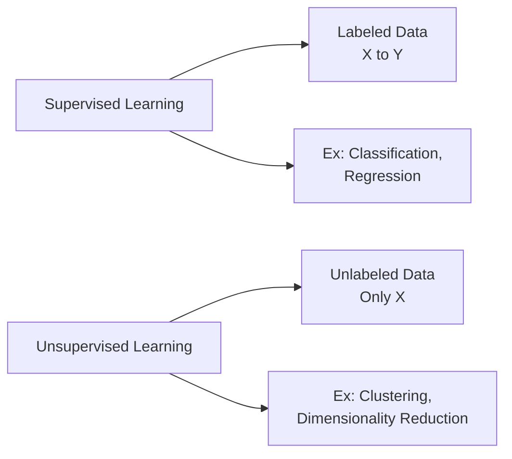
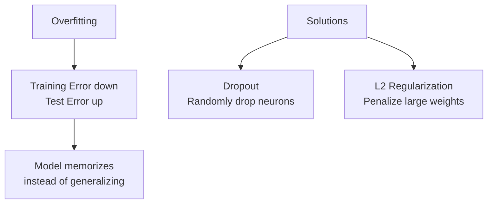
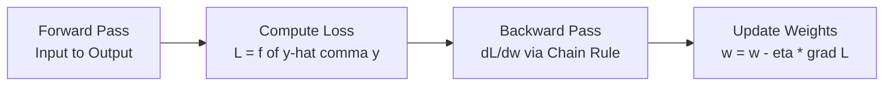
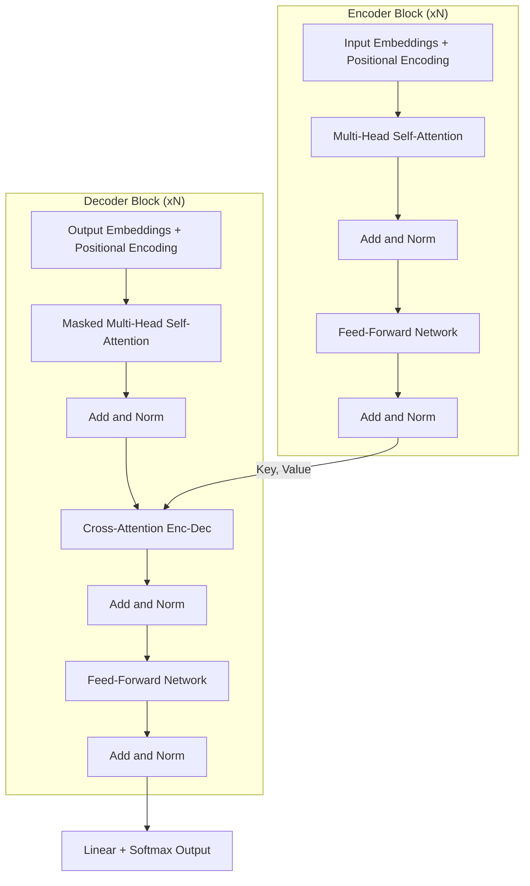

# Deep Learning Test - Answers

## Section A (4 Marks)

### A1. Supervised vs Unsupervised Learning [2]



| Type | Definition | Example |
|------|------------|---------|
| **Supervised** | Learning with labeled input-output pairs (X,y) | MNIST digit classification: Image to Digit label |
| **Unsupervised** | Finding patterns in unlabeled data | K-means clustering customer segments |

---

### A2. Loss Function [2]

**Definition:** Mathematical function measuring error between predicted and actual output.

$$\mathcal{L}(\hat{y}, y) = \text{difference metric}$$

| Loss Function | Formula | Use Case |
|---------------|---------|----------|
| **Cross-Entropy** | $-\sum y \log(\hat{y})$ | Classification |
| **MSE** | $\frac{1}{n}\sum(y-\hat{y})^2$ | Regression |

---

## Section B (6 Marks)

### B1. Overfitting & Techniques [3]



**Overfitting:** Model performs well on training data but poorly on new data.

| Technique | How It Works | Math |
|-----------|--------------|------|
| **Dropout** | Randomly set neurons to 0 during training | $p=0.5$ typical |
| **L2 Regularization** | Add penalty term to loss | $\mathcal{L}_{total} = \mathcal{L} + \lambda\sum w^2$ |

---

### B2. Backpropagation & Chain Rule [3]



**Backpropagation:** Algorithm to compute gradients by propagating error backwards through network.

**Chain Rule:** For composite function $f(g(x))$:

$$\frac{\partial L}{\partial w_1} = \frac{\partial L}{\partial z_3} \cdot \frac{\partial z_3}{\partial z_2} \cdot \frac{\partial z_2}{\partial w_1}$$

**Why Essential:** Enables efficient gradient computation in multi-layer networks by reusing intermediate derivatives.

---

## Section C (10 Marks)

### C1. CNN Pipeline [5]

```
Input Image (32x32x3)
        |
  Conv + ReLU          <- filters extract low-level features (edges, colours)
        |
  MaxPool (2x2)        <- halve spatial dimensions
        |
  Conv + ReLU          <- filters extract higher-level features
        |
  MaxPool (2x2)        <- halve again
        |
  Flatten              <- reshape 3-D feature maps -> 1-D vector
        |
  FC Layers            <- learn class-discriminative combinations
        |
  Softmax              -> class probabilities
```

| Component | Purpose | Parameters |
|-----------|---------|------------|
| **Convolution** | Feature extraction via filters | Weights W_{kxk} |
| **Stride** | Step size for filter movement | s=1 or s=2 |
| **Padding** | Border pixels to preserve size | p=(k-1)/2 |
| **Pooling** | Spatial downsampling | 2x2 max pool |
| **Flatten** | Convert 3D to 1D vector | No parameters |
| **FC Layer** | Final classification | Weights + bias |

**Why CNNs work for images:**
1. **Parameter sharing:** Same filter across spatial locations
2. **Local connectivity:** Exploit spatial correlation
3. **Translation invariance:** Pooling provides robustness

**Output size formula:**
$$n_{out} = \left\lfloor\frac{n + 2p - k}{s}\right\rfloor + 1$$

---

### C2. Transformer Architecture [5]



**Core Components:**

| Component | Intuition | Math |
|-----------|-----------|------|
| **Self-Attention** | Words attend to all other words | $\text{Attention}(Q,K,V) = \text{softmax}\left(\frac{QK^T}{\sqrt{d_k}}\right)V$ |
| **Multi-Head** | Multiple parallel attention mechanisms | 8-16 heads typical |
| **Positional Encoding** | Add position information (no recurrence) | $PE_{pos,2i} = \sin(pos/10000^{2i/d})$ |

**Advantages over RNNs:**

| Feature | RNN | Transformer |
|---------|-----|-------------|
| **Parallelization** | Sequential | Fully parallel |
| **Long Dependencies** | Vanishing gradient | Direct attention |
| **Training Speed** | Slow | Fast (GPU-friendly) |

**Attention Mechanism:**
- Query (Q): "What am I looking for?"
- Key (K): "What do I contain?"
- Value (V): "What do I output?"

$$\alpha_{ij} = \frac{\exp(q_i \cdot k_j)}{\sum_k \exp(q_i \cdot k_k)}$$
