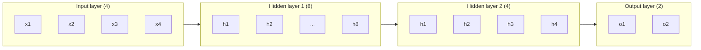
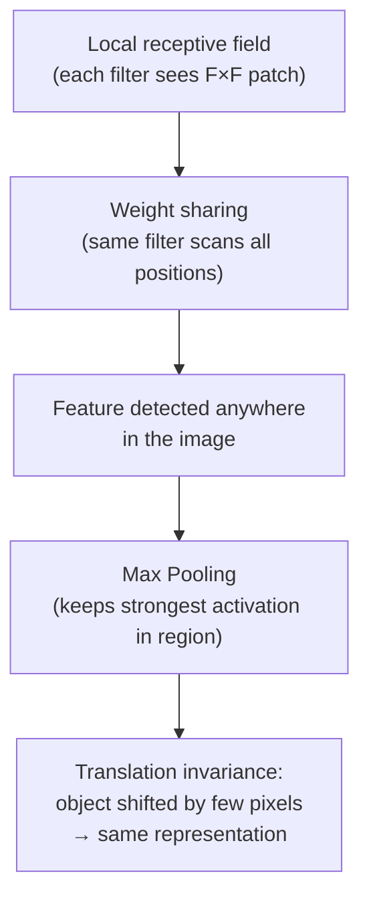

# Deep Learning — Answer Key: Paper 1

**Topics: PyTorch Tensors · Perceptron · MLP · Backpropagation · CNNs**

---

## Section A (4 Marks)

---

### A1. PyTorch Tensors [2]

**Definition**

A **PyTorch tensor** is a multi-dimensional array (analogous to a NumPy `ndarray`) that supports:
- Automatic differentiation (`autograd`)
- GPU acceleration via CUDA
- Seamless integration with the PyTorch neural-network API

| Feature | NumPy array | PyTorch tensor |
|---|---|---|
| GPU support | ❌ CPU only | ✅ `.cuda()` / `.to(device)` |
| Autograd | ❌ | ✅ `requires_grad=True` |
| Interop | Standalone | Integrates with `nn.Module` |

**GPU tensor creation**

```python
x = torch.zeros(3, 4, device='cuda')
```

*Equivalent: `torch.zeros(3, 4).cuda()`*

---

### A2. Perceptron Learning Rule [2]

**Learning rule**

$$w \leftarrow w + \eta \cdot (y - \hat{y}) \cdot x$$

**Calculation**

Given: $w = 0.5$, $b = 0$, $\eta = 0.1$, $x = 1$, $y = 1$, $\hat{y} = 0$

$$w_{\text{new}} = 0.5 + 0.1 \times (1 - 0) \times 1 = 0.5 + 0.1 = \mathbf{0.6}$$

The weight increases because the perceptron predicted 0 when the true label was 1 (false negative).

---

## Section B (6 Marks)

---

### B1. Multi-Layer Perceptron and Activation Functions [3]

**(a) 2-hidden-layer MLP architecture**



**(b) Why non-linear activations are necessary**

Without non-linearity, stacking layers collapses to a single affine transformation:

$$\mathbf{y} = W_2(W_1 \mathbf{x} + b_1) + b_2 = (W_2 W_1)\mathbf{x} + (W_2 b_1 + b_2) = W'\mathbf{x} + b'$$

Regardless of the number of layers, the network can only represent **linear** functions. Non-linear activations allow the network to approximate any continuous function (Universal Approximation Theorem).

**(c) ReLU formula and graph**

$$\text{ReLU}(z) = \max(0, z) = \begin{cases} z & z > 0 \\ 0 & z \le 0 \end{cases}$$

```
Output
  |
  |         /
  |        /
  |       /
  |------+--------> z
  0     0
```

Key property: gradient is either 0 or 1, avoiding Sigmoid's small-gradient issue (though "dead ReLU" can occur for $z < 0$).

---

### B2. Backpropagation and the Chain Rule [3]

**(a) Chain rule**

$$\frac{d\mathcal{L}}{dw} = \frac{d\mathcal{L}}{da} \cdot \frac{da}{dz} \cdot \frac{dz}{dw}$$

**(b) Gradient derivation for a single neuron**

Given $z = wx + b$, $a = \sigma(z)$, loss $\mathcal{L}$:

$$\frac{\partial z}{\partial w} = x$$

$$\frac{\partial a}{\partial z} = \sigma'(z) = \sigma(z)(1 - \sigma(z))$$

$$\frac{\partial \mathcal{L}}{\partial w} = \frac{\partial \mathcal{L}}{\partial a} \cdot \sigma'(z) \cdot x$$

**(c) Forward vs backward pass**

| Pass | Direction | Purpose |
|---|---|---|
| **Forward** | Input → Output | Compute $\hat{y}$ and loss $\mathcal{L}$ |
| **Backward** | Output → Input | Compute $\partial\mathcal{L}/\partial\theta$ for all parameters using chain rule |
| **Update** | — | $\theta \leftarrow \theta - \eta \cdot \nabla_\theta \mathcal{L}$ |

The backward pass reuses intermediate values cached during the forward pass, making it computationally efficient.

---

## Section C (10 Marks)

---

### C1. CNN — Convolution and Pooling [5]


*Source: D2L.ai — LeNet-style CNN architecture (LeCun et al. 1998)*

**(a) 2-D convolution formula**

$$z_{i,j} = \sum_{p=0}^{F-1} \sum_{q=0}^{F-1} W_{p,q} \cdot X_{i+p,\, j+q} + b$$

For $C_{\text{in}}$ input channels:

$$z_{i,j} = \sum_{c=1}^{C_{\text{in}}} \sum_{p=0}^{F-1} \sum_{q=0}^{F-1} W_{p,q,c} \cdot X_{i+p,\, j+q,\, c} + b$$

**(b) Calculation — output size and parameters**

Output spatial size formula:

$$O = \left\lfloor \frac{W - F + 2P}{S} \right\rfloor + 1 = \left\lfloor \frac{28 - 3 + 0}{1} \right\rfloor + 1 = \mathbf{26}$$

Output: $26 \times 26$ feature map per filter → $26 \times 26 \times 32$ total.

Parameters:

$$\text{params} = (F \times F \times C_{\text{in}} + 1) \times C_{\text{out}} = (3 \times 3 \times 1 + 1) \times 32 = 10 \times 32 = \mathbf{320}$$

**(c) Max pooling**

A $2 \times 2$ max-pool with stride 2 takes the **maximum** value from each $2 \times 2$ non-overlapping patch:

$$y_{i,j} = \max\!\left(X_{2i,\, 2j},\; X_{2i+1,\, 2j},\; X_{2i,\, 2j+1},\; X_{2i+1,\, 2j+1}\right)$$

After pooling a $26 \times 26$ map: $\lfloor 26/2 \rfloor = 13 \to$ output size $= \mathbf{13 \times 13}$

**(d) Advantage of parameter sharing**

| | CNN | Fully Connected |
|---|---|---|
| Parameters for a $28\times28$ input with 32 filters | 320 | $784 \times 32 = 25{,}088$ |
| Translation invariance | ✅ Same filter detects feature anywhere | ❌ Position-specific neurons |

Parameter sharing enforces the inductive bias that **useful features (edges, textures) appear anywhere in the image**, not just at fixed locations.

---

### C2. CNN Architecture — Full Pipeline [5]

**(a) Architecture for $28\times28$ grayscale → 10 classes**

| # | Layer | Config |
|---|---|---|
| 1 | Conv2D | 1 → 32 filters, $3\times3$, stride 1, no padding |
| 2 | ReLU | — |
| 3 | MaxPool | $2\times2$, stride 2 |
| 4 | Conv2D | 32 → 64 filters, $3\times3$, stride 1, no padding |
| 5 | ReLU | — |
| 6 | MaxPool | $2\times2$, stride 2 |
| 7 | Flatten | → 1-D vector |
| 8 | FC (Dense) | 1600 → 128, ReLU |
| 9 | FC (Dense) | 128 → 10, Softmax |

Spatial dimension tracking:

$$28 \xrightarrow{\text{Conv}(3\times3)} 26 \xrightarrow{\text{Pool}(2\times2)} 13 \xrightarrow{\text{Conv}(3\times3)} 11 \xrightarrow{\text{Pool}(2\times2)} \lfloor 11/2 \rfloor = 5$$

Flatten size: $5 \times 5 \times 64 = 1600$

**(b) Parameter count table**

| Layer | Formula | Params |
|---|---|---|
| Conv2D (1→32, 3×3) | $(3\times3\times1+1)\times32$ | 320 |
| Conv2D (32→64, 3×3) | $(3\times3\times32+1)\times64$ | 18,496 |
| FC (1600→128) | $1600\times128 + 128$ | 205,056 |
| FC (128→10) | $128\times10 + 10$ | 1,290 |
| **Total** | | **225,162** |

**(c) Translation invariance — mechanism**



- **Local receptive field**: restricts each neuron to a small patch, preserving spatial locality.
- **Weight sharing**: the same filter detects the same feature (e.g. horizontal edge) regardless of position.
- **Max pooling**: discards exact location, keeping only *whether* a feature was present in a region.

---

*Answer key for Deep Learning exam — Paper 1*
