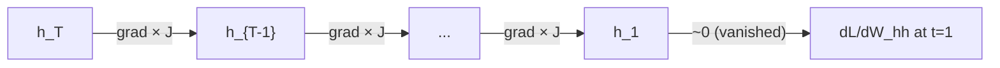

# Deep Learning — Answer Key: Paper 2

**Topics: Activation Functions · Vanishing Gradients · Regularisation (Dropout, BatchNorm, L2) · RNN · BPTT**

---

## Section A (4 Marks)

---

### A1. Activation Functions [2]

**(a) Formulas**

$$\sigma(z) = \frac{1}{1 + e^{-z}} \qquad \text{(Sigmoid)}$$

$$\tanh(z) = \frac{e^z - e^{-z}}{e^z + e^{-z}} = 2\sigma(2z) - 1 \qquad \text{(Tanh)}$$

| Property | Sigmoid | Tanh |
|---|---|---|
| Output range | $(0, 1)$ | $(-1, 1)$ |
| Centred at 0 | ❌ | ✅ |
| Saturates | ✅ (both ends) | ✅ (both ends) |
| Max gradient | 0.25 at $z=0$ | 1.0 at $z=0$ |

**(b) Maximum derivative of Sigmoid**

$$\frac{d\sigma}{dz} = \sigma(z)(1-\sigma(z))$$

Maximum at $z = 0$: $\sigma(0) = 0.5 \Rightarrow \frac{d\sigma}{dz}\bigg|_{z=0} = 0.5 \times 0.5 = \mathbf{0.25}$

**Why this matters**: Gradients are multiplied by at most 0.25 at every Sigmoid layer. In a deep network, successive multiplications drive the gradient toward zero — the **vanishing gradient** problem.

---

### A2. Vanishing Gradient Problem [2]

**(a) Definition**

The **vanishing gradient problem** occurs in deep networks (especially those using Sigmoid/Tanh activations) when gradients of the loss with respect to early-layer parameters become exponentially small as they are backpropagated through many layers, effectively halting learning in early layers.

**(b) Mathematical argument**

During backpropagation through 10 Sigmoid layers, the gradient at the input layer involves a product of 10 derivative terms:

$$\frac{\partial \mathcal{L}}{\partial w_1} = \frac{\partial \mathcal{L}}{\partial a_{10}} \cdot \prod_{k=1}^{10} \frac{\partial a_k}{\partial a_{k-1}}$$

Each factor $\dfrac{\partial a_k}{\partial a_{k-1}}$ contains a Sigmoid derivative $\le 0.25$:

$$\left|\frac{\partial \mathcal{L}}{\partial w_1}\right| \le \left|\frac{\partial \mathcal{L}}{\partial a_{10}}\right| \times (0.25)^{10} \approx \left|\frac{\partial \mathcal{L}}{\partial a_{10}}\right| \times 10^{-6}$$

The gradient shrinks by a factor of $10^{-6}$, making it effectively zero — the first layer learns nothing.

---

## Section B (6 Marks)

---

### B1. Dropout and Batch Normalisation [3]

**(a) Dropout**

During **training**: each neuron is independently set to zero with probability $p$ (dropout rate) at each forward pass:

$$\tilde{h}_i = h_i \cdot m_i, \qquad m_i \sim \text{Bernoulli}(1-p)$$

During **inference (test time)**: all neurons are active. Weights are scaled by $(1-p)$ to maintain the same expected activation magnitude:

$$h_i^{\text{test}} = (1-p) \cdot h_i$$

*Why scaling*: Without scaling, the expected sum at each neuron would be larger at test time than during training (by factor $1/(1-p)$), distorting predictions.

**(b) Batch Normalisation formula**

For a mini-batch $\mathcal{B} = \{x_1, \ldots, x_m\}$:

$$\hat{x}_i = \frac{x_i - \mu_\mathcal{B}}{\sqrt{\sigma^2_\mathcal{B} + \varepsilon}}, \qquad y_i = \gamma \hat{x}_i + \beta$$

where:
- $\mu_\mathcal{B} = \frac{1}{m}\sum_i x_i$ — batch mean
- $\sigma^2_\mathcal{B} = \frac{1}{m}\sum_i (x_i - \mu_\mathcal{B})^2$ — batch variance
- $\varepsilon$ — small constant for numerical stability
- $\gamma, \beta$ — **learnable** scale and shift parameters

**(c) Two additional benefits of BatchNorm**

1. **Faster training / higher learning rates**: normalising activations reduces internal covariate shift, allowing larger learning rates without divergence.
2. **Reduces sensitivity to weight initialisation**: the network is less dependent on the scale of initial weights because activations are renormalised at each layer.

---

### B2. L2 Regularisation (Weight Decay) [3]

**(a) Regularised loss**

$$\mathcal{L}_{\text{reg}}(\boldsymbol{\theta}) = \mathcal{L}(\boldsymbol{\theta}) + \frac{\lambda}{2}\|\boldsymbol{\theta}\|^2 = \mathcal{L}(\boldsymbol{\theta}) + \frac{\lambda}{2}\sum_j w_j^2$$

**(b) Gradient and weight decay equivalence**

$$\frac{\partial \mathcal{L}_{\text{reg}}}{\partial w} = \frac{\partial \mathcal{L}}{\partial w} + \lambda w$$

Update rule:

$$w \leftarrow w - \eta\left(\frac{\partial \mathcal{L}}{\partial w} + \lambda w\right) = w(1 - \eta\lambda) - \eta\frac{\partial \mathcal{L}}{\partial w}$$

The factor $(1 - \eta\lambda)$ **shrinks** $w$ at every step — this is exactly **weight decay**. Large weights are penalised, encouraging simpler models with smaller parameter magnitudes.

**(c) L1 vs L2**

| | L1 ($\lambda\|w\|_1$) | L2 ($\frac{\lambda}{2}\|w\|^2$) |
|---|---|---|
| Penalty shape | Diamond (sharp corners) | Sphere (smooth) |
| Effect on weights | Drives many weights to **exactly 0** (sparse) | Shrinks weights toward 0 but rarely exactly 0 |
| Sparsity | ✅ Induces sparsity | ❌ |
| Gradient | Constant sign ($\pm\lambda$) | Proportional to $w$ |

**L1 produces sparser weights** because its non-differentiable corner at $w=0$ makes the minimum often lie on a coordinate axis (many weights = 0).

---

## Section C (10 Marks)

---

### C1. Recurrent Neural Networks [5]

**(a) Unrolled RNN architecture**

*Source: D2L.ai — Unrolled RNN over multiple time steps*

**(b) State-update and output equations**

$$\mathbf{h}_t = \tanh\!\left(W_{xh}\,\mathbf{x}_t + W_{hh}\,\mathbf{h}_{t-1} + \mathbf{b}_h\right)$$

$$\mathbf{o}_t = W_{hy}\,\mathbf{h}_t + \mathbf{b}_y$$

| Symbol | Meaning |
|---|---|
| $\mathbf{x}_t \in \mathbb{R}^{d}$ | Input at time $t$ |
| $\mathbf{h}_t \in \mathbb{R}^{h}$ | Hidden state at time $t$ |
| $\mathbf{o}_t \in \mathbb{R}^{q}$ | Output at time $t$ |
| $W_{xh} \in \mathbb{R}^{h \times d}$ | Input-to-hidden weight matrix |
| $W_{hh} \in \mathbb{R}^{h \times h}$ | Hidden-to-hidden (recurrent) weight matrix |
| $W_{hy} \in \mathbb{R}^{q \times h}$ | Hidden-to-output weight matrix |
| $\mathbf{b}_h, \mathbf{b}_y$ | Bias vectors |

**(c) Parameter count** — hidden size $h=64$, input size $d=10$, output size $q=5$

| Matrix | Dimensions | Parameters |
|---|---|---|
| $W_{xh}$ | $64 \times 10$ | 640 |
| $W_{hh}$ | $64 \times 64$ | 4,096 |
| $\mathbf{b}_h$ | $64$ | 64 |
| $W_{hy}$ | $5 \times 64$ | 320 |
| $\mathbf{b}_y$ | $5$ | 5 |
| **Total** | | **5,125** |

**(d) Weight reuse across time steps**

The same $W_{hh}$ and $W_{xh}$ are reused because the **sequence-processing function is the same at every step** — this is analogous to parameter sharing in CNNs. It encodes the assumption that the relationship between input tokens and hidden state is **stationary** (does not change with position in the sequence), dramatically reducing the number of parameters.

---

### C2. Backpropagation Through Time (BPTT) [5]

**(a) BPTT vs standard backpropagation**

Standard backpropagation computes gradients by unrolling the computation graph of a static network depth $L$. BPTT **unrolls the RNN across $T$ time steps**, treating each unrolled copy as a separate layer. This is necessary because the hidden state $\mathbf{h}_t$ depends on $\mathbf{h}_{t-1}$, creating a temporal dependency chain that must be unrolled to apply the chain rule.

**(b) Gradient of loss w.r.t. $W_{hh}$**

The total loss $\mathcal{L} = \sum_{t=1}^{T} \mathcal{L}_t$. Applying the chain rule:

$$\frac{\partial \mathcal{L}}{\partial W_{hh}} = \sum_{t=1}^{T} \frac{\partial \mathcal{L}_t}{\partial W_{hh}}$$

Each term requires tracing back through hidden states:

$$\frac{\partial \mathcal{L}_t}{\partial W_{hh}} = \sum_{k=1}^{t} \left(\prod_{j=k+1}^{t} \frac{\partial \mathbf{h}_j}{\partial \mathbf{h}_{j-1}}\right) \frac{\partial \mathbf{h}_k}{\partial W_{hh}}$$

where $\dfrac{\partial \mathbf{h}_j}{\partial \mathbf{h}_{j-1}} = \text{diag}(\tanh'(\mathbf{z}_j)) \cdot W_{hh}$ and $\mathbf{z}_j = W_{xh}\mathbf{x}_j + W_{hh}\mathbf{h}_{j-1} + \mathbf{b}_h$.

**(c) Vanishing gradient in BPTT**

The gradient product across $T$ steps involves repeated multiplication by the Jacobian $\dfrac{\partial \mathbf{h}_j}{\partial \mathbf{h}_{j-1}}$:

$$\left\|\prod_{j=k}^{t} \frac{\partial \mathbf{h}_j}{\partial \mathbf{h}_{j-1}}\right\| \le \left(\rho(W_{hh}) \cdot \max |\tanh'|\right)^{t-k}$$

If $\rho(W_{hh}) < 1/\max|\tanh'|$, this product $\to 0$ exponentially as $t - k \to \infty$.

**Consequence**: Gradients for early time steps become negligibly small, so the RNN cannot learn **long-range dependencies** — events far in the past have no effect on the gradient, and the model forgets them.

**(d) Two mitigation strategies**

1. **Gradient clipping**: if $\|\nabla \mathcal{L}\| > \text{threshold}$, scale the gradient: $\mathbf{g} \leftarrow \mathbf{g} \cdot \frac{\text{threshold}}{\|\mathbf{g}\|}$. Prevents gradient explosion and stabilises training.

2. **Truncated BPTT**: instead of backpropagating through all $T$ steps, only unroll $k$ steps (e.g. $k=20$). Reduces the depth of the computation graph and the severity of vanishing, at the cost of ignoring very long-range dependencies.

---

*Answer key for Deep Learning exam — Paper 2*
