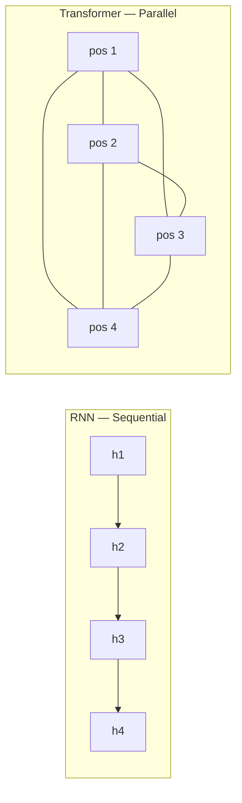

# Deep Learning — Answer Key: Paper 3

**Topics: LSTM Gates · GRU · Seq2Seq · Attention Mechanism · Transformers**

---

## Section A (4 Marks)

---

### A1. LSTM Gates [2]

**(a) Four gates/components and their roles**


*Source: D2L.ai — LSTM cell showing forget, input, cell, and output gates*

| Component | Role |
|---|---|
| **Forget gate** $f_t$ | Decides what fraction of the previous cell state $C_{t-1}$ to discard |
| **Input gate** $i_t$ | Decides which new information from $\mathbf{x}_t$ and $\mathbf{h}_{t-1}$ is written to the cell |
| **Cell gate** $\tilde{C}_t$ | Creates a candidate new cell state using $\tanh$ |
| **Output gate** $o_t$ | Controls how much of the cell state is exposed as the hidden state $\mathbf{h}_t$ |

**(b) Forget gate equation and interpretation**

$$f_t = \sigma\!\left(W_f \cdot [\mathbf{h}_{t-1},\, \mathbf{x}_t] + b_f\right)$$

| Value | Meaning |
|---|---|
| $f_t \approx 0$ | **Forget**: the previous cell state $C_{t-1}$ is almost entirely erased at this dimension |
| $f_t \approx 1$ | **Keep**: the previous cell state passes through unchanged |

This gate allows the LSTM to **selectively remember** long-term information — e.g. forgetting the gender of a subject after a full stop, but remembering it across a short phrase.

---

### A2. Gated Recurrent Unit (GRU) [2]

**(a) Two gates and their formulas**


*Source: D2L.ai — GRU cell showing reset and update gates*

**Update gate** $z_t$ — controls how much of the previous hidden state to keep:

$$z_t = \sigma\!\left(W_z \cdot [\mathbf{h}_{t-1},\, \mathbf{x}_t] + b_z\right)$$

**Reset gate** $r_t$ — controls how much of the previous hidden state is used to compute the candidate:

$$r_t = \sigma\!\left(W_r \cdot [\mathbf{h}_{t-1},\, \mathbf{x}_t] + b_r\right)$$

Candidate hidden state and final update:

$$\tilde{\mathbf{h}}_t = \tanh\!\left(W \cdot [r_t \odot \mathbf{h}_{t-1},\, \mathbf{x}_t]\right)$$

$$\mathbf{h}_t = (1 - z_t) \odot \mathbf{h}_{t-1} + z_t \odot \tilde{\mathbf{h}}_t$$

**(b) Simplification, advantage, and disadvantage**

GRU **merges** the LSTM's forget and input gates into a single update gate $z_t$, and eliminates the separate cell state $C_t$ (hidden state $\mathbf{h}_t$ serves both roles).

| | Advantage | Disadvantage |
|---|---|---|
| GRU vs LSTM | Fewer parameters → faster training; less data needed | Less expressive — cannot independently control memory read/write |

---

## Section B (6 Marks)

---

### B1. Sequence-to-Sequence (Seq2Seq) Models [3]

**(a) Encoder–decoder architecture and context vector**


*Source: D2L.ai — Sequence-to-sequence encoder–decoder architecture*

The **context vector** $\mathbf{c}$ is the final encoder hidden state $\mathbf{h}_T^{\text{enc}}$. It is a fixed-size real-valued vector that is supposed to encode the **entire source sentence** semantics and is passed as the initial hidden state (or input) to the decoder.

**(b) Translation example: "I am happy" → "Je suis heureux"**

```
Encoder                            Decoder
 ┌─────┐   ┌─────┐   ┌─────┐      ┌─────┐   ┌─────┐   ┌─────┐
 │  I  │──►│ am  │──►│happy│──c──►│ Je  │──►│suis │──►│heureux│
 └─────┘   └─────┘   └─────┘      └─────┘   └─────┘   └─────┘
                         ↑ context vector c = h3_enc
```

**(c) Information bottleneck problem**

The entire source sentence must be compressed into a **single fixed-size vector** $\mathbf{c}$, regardless of sentence length. For long or complex sentences this representation loses information. Increasing encoder hidden size helps somewhat (larger $\mathbf{c}$ has more capacity), but the bottleneck is fundamental: **all information must still pass through one vector**, which does not scale with sequence length.

The **attention mechanism** resolves this by giving the decoder direct access to *all* encoder hidden states.

---

### B2. Attention Mechanism [3]

**(a) Problem solved by attention**


*Source: D2L.ai — Seq2Seq with Bahdanau attention: decoder attends to all encoder hidden states at each step*

In vanilla Seq2Seq, the decoder receives only the final encoder hidden state, forcing the context vector to summarise the entire input. For long sequences this causes the **information bottleneck** — early tokens are poorly represented by the time encoding is complete. Attention lets the decoder **selectively focus on different parts** of the input sequence at each decoding step.

**(b) Context vector formula with attention**

$$c_t = \sum_{s=1}^{S} \alpha_{t,s}\, \mathbf{h}_s^{\text{enc}}$$

where $\alpha_{t,s}$ is the attention weight indicating how much decoder step $t$ should attend to encoder position $s$, and $\mathbf{h}_s^{\text{enc}}$ is the encoder hidden state at position $s$.

**(c) Computing attention weights (Bahdanau additive attention)**

1. Compute **alignment scores** using a learned scoring function $a$:

$$e_{t,s} = \mathbf{v}_a^\top \tanh\!\left(W_a\,\mathbf{h}_{t-1}^{\text{dec}} + U_a\,\mathbf{h}_s^{\text{enc}}\right)$$

2. Normalise with **softmax** to get attention weights:

$$\alpha_{t,s} = \frac{\exp(e_{t,s})}{\sum_{s'=1}^{S} \exp(e_{t,s'})}$$

**Why softmax**: it ensures $\sum_s \alpha_{t,s} = 1$, so the context vector $c_t$ is a convex combination (weighted average) of encoder states. This is interpretable as a probability distribution over source positions — i.e., *which source words is the decoder currently focusing on*.

---

## Section C (10 Marks)

---

### C1. Transformer Architecture [5]

**(a) Full Transformer architecture**


*Source: D2L.ai — Transformer architecture (Vaswani et al. 2017, "Attention Is All You Need")*

Key components:

| Component | Location | Role |
|---|---|---|
| **Positional Encoding** | Input to encoder & decoder | Injects position information into embeddings |
| **Multi-Head Attention** | Encoder & Decoder | Computes weighted context over all positions |
| **Feed-Forward Sub-layer** | Each encoder/decoder block | Position-wise MLP applied to each token |
| **Add & Norm** | After each sub-layer | Residual connection + layer normalisation for stability |
| **Masked Self-Attention** | Decoder only | Prevents attending to future tokens during training |

**(b) Scaled dot-product attention derivation**

Given query $Q \in \mathbb{R}^{n \times d_k}$, key $K \in \mathbb{R}^{n \times d_k}$, value $V \in \mathbb{R}^{n \times d_v}$:

1. Compute raw attention scores: $S = QK^\top \in \mathbb{R}^{n \times n}$
2. Scale: $S' = S / \sqrt{d_k}$
3. Apply softmax row-wise: $A = \text{softmax}(S')$
4. Compute output: $\text{Attention}(Q,K,V) = AV$

$$\boxed{\text{Attention}(Q, K, V) = \text{softmax}\!\left(\frac{QK^\top}{\sqrt{d_k}}\right)V}$$

**Purpose of $1/\sqrt{d_k}$ scaling**: For large $d_k$, the dot products $QK^\top$ grow in magnitude (variance $\propto d_k$), pushing the softmax into saturation regions where gradients are near zero. Dividing by $\sqrt{d_k}$ stabilises the variance at ~1, keeping softmax in its sensitive regime.

**(c) Multi-head attention**


*Source: D2L.ai — Multi-head attention mechanism*

$$\text{MultiHead}(Q,K,V) = \text{Concat}(\text{head}_1, \ldots, \text{head}_h)\,W^O$$

$$\text{head}_i = \text{Attention}(QW_i^Q,\; KW_i^K,\; VW_i^V)$$

Each head projects $Q, K, V$ into a **different lower-dimensional subspace** and attends independently. Concatenating heads allows the model to jointly attend to information from **different representation subspaces at different positions** — e.g. one head might capture syntactic relationships, another semantic proximity.

**(d) Positional encoding**

$$PE_{(pos, 2i)} = \sin\!\left(\frac{pos}{10000^{2i/d}}\right)$$

$$PE_{(pos, 2i+1)} = \cos\!\left(\frac{pos}{10000^{2i/d}}\right)$$

where $pos$ is the position in the sequence, $i$ is the dimension index, and $d$ is the model embedding dimension.

**Why sinusoidal**: (i) unique encoding for every position, (ii) bounded output in $[-1, 1]$, (iii) the model can learn to attend by **relative positions** because $PE_{pos+k}$ can be expressed as a **linear combination** of $PE_{pos}$ via trigonometric addition formulas — enabling relative-position generalisation. (iv) Generalises to sequence lengths not seen during training.

---

### C2. Transformers vs RNNs — Comparative Analysis [5]

**(a) Comparison table**

| Property | RNN / LSTM | Transformer |
|---|---|---|
| **Parallelism during training** | ❌ Sequential — $h_t$ depends on $h_{t-1}$ | ✅ All tokens processed simultaneously |
| **Long-range dependencies** | ⚠️ Vanishing gradient; LSTM partially solves | ✅ Direct $O(1)$-path attention between any two positions |
| **Computational complexity per layer** | $O(n \cdot d^2)$ — linear in sequence length | $O(n^2 \cdot d)$ — quadratic in sequence length |
| **Positional information** | ✅ Implicit — processing order gives position | ❌ Must be added explicitly (positional encoding) |
| **Memory / context window** | Limited by hidden state capacity | Fixed but large (up to context window size) |

**(b) Why Transformers parallelise better**

In an RNN, the hidden state update:

$$\mathbf{h}_t = f(\mathbf{h}_{t-1}, \mathbf{x}_t)$$

creates a **sequential dependency chain** — $\mathbf{h}_3$ cannot be computed until $\mathbf{h}_2$ is known, which requires $\mathbf{h}_1$, etc. This prevents GPU parallelism over time steps.

In a Transformer, **all positions attend to all positions simultaneously** via matrix operations:

$$\text{Attention} = \text{softmax}\!\left(\frac{QK^\top}{\sqrt{d_k}}\right)V$$

$Q, K, V$ are computed in **one batched matrix multiplication** over all $n$ positions at once, fully exploiting GPU tensor cores.



**(c) Self-attention complexity**

The scaled dot-product attention computes $QK^\top \in \mathbb{R}^{n \times n}$: every one of $n$ queries attends to every one of $n$ keys, resulting in:

$$\text{Time complexity: } O(n^2 \cdot d)$$

For very long sequences (e.g. $n = 16384$ for long documents or high-res images), the $n^2$ term becomes a memory and compute bottleneck. This has motivated **efficient attention** variants (Longformer, BigBird, Flash Attention) that approximate the full attention matrix.

**(d) Real-world applications where Transformers replaced RNNs**

1. **Machine Translation** (e.g. Google Translate): The original Transformer paper (Vaswani et al. 2017) demonstrated state-of-the-art BLEU scores on WMT English–German. Transformers replaced LSTM-based Seq2Seq because they train faster and handle long sentences better through direct attention.

2. **Language Modelling / Large Language Models** (GPT, BERT, LLaMA): LSTM-based language models (e.g. ELMo) were replaced by Transformer-based models because Transformers scale effectively with data and compute, parallelize during training, and capture bidirectional context (BERT) or generate coherent long-form text (GPT) far more effectively.

---

*Answer key for Deep Learning exam — Paper 3*
