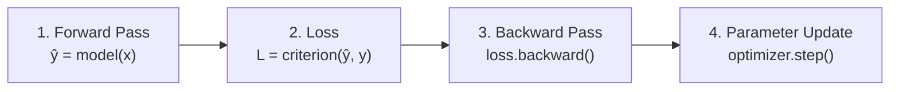

# Deep Learning — Paper 4: Questions and Answers

**Topics: Binary Cross-Entropy Loss · ReLU vs Sigmoid (VGP) · CNN Output Dimensions · Batch Normalisation · GRU · Seq2Seq · Neural Network Training Pipeline**

**Time: 1 hour 30 mins | Max Marks: 20**

**Instructions:**
1. All questions are compulsory.
2. Keep your answers concise and strictly to the point. Avoid unnecessary elaboration where a direct mathematical proof or technical explanation is sufficient.
3. Use standard deep learning mathematical notations.

---

## Section A (4 Marks)

*Answer the following short questions. 2 × 2 = 4*

---

### A1. Binary Cross-Entropy Loss [2]

**Question:** In the PyTorch `nn` module, `nn.BCELoss()` is commonly used for binary classification. Write the mathematical formula for Binary Cross-Entropy Loss for a single true label $y$ and prediction $\hat{y}$. Take an example and calculate the loss.

---

**Answer:**

**Formula:**

$$\mathcal{L}_{\text{BCE}}(y,\, \hat{y}) = -\bigl[y \log(\hat{y}) + (1 - y)\log(1 - \hat{y})\bigr]$$

| Symbol | Meaning |
|---|---|
| $y \in \{0, 1\}$ | True binary label |
| $\hat{y} \in (0, 1)$ | Predicted probability (output of Sigmoid) |

**Worked Example:**

Let $y = 1$ (positive class) and $\hat{y} = 0.9$ (model is 90% confident the class is positive):

$$\mathcal{L} = -[1 \times \log(0.9) + 0 \times \log(0.1)]$$

$$= -\log(0.9) = -(-0.1054) \approx \mathbf{0.105}$$

For comparison, if the model predicts poorly ($\hat{y} = 0.1$ for $y = 1$):

$$\mathcal{L} = -\log(0.1) \approx 2.303 \quad \text{(much higher loss)}$$

**PyTorch usage:**

```python
import torch
import torch.nn as nn

criterion = nn.BCELoss()
y_pred = torch.tensor([0.9])   # after Sigmoid
y_true = torch.tensor([1.0])
loss = criterion(y_pred, y_true)   # ≈ 0.1054
```

> **Note:** `nn.BCELoss` requires predictions to be passed through `torch.sigmoid()` first. Alternatively, use `nn.BCEWithLogitsLoss` which combines Sigmoid + BCE in a numerically stable way.

---

### A2. ReLU vs Sigmoid — Vanishing Gradient Problem [2]

**Question:** Why is the derivative of the ReLU activation function mathematically superior to the Sigmoid function for preventing the Vanishing Gradient Problem (VGP)?

---

**Answer:**

**Sigmoid derivative:**

$$\sigma(z) = \frac{1}{1 + e^{-z}}, \qquad \sigma'(z) = \sigma(z)(1 - \sigma(z)) \leq 0.25$$

The maximum is $0.25$ at $z = 0$ and decays towards $0$ at both extremes.

**ReLU derivative:**

$$\text{ReLU}(z) = \max(0, z), \qquad \text{ReLU}'(z) = \begin{cases} 1 & z > 0 \\ 0 & z \leq 0 \end{cases}$$

**Mathematical argument for VGP:**

During backpropagation through $L$ Sigmoid layers, the gradient involves a product of $L$ derivative terms:

$$\left|\frac{\partial \mathcal{L}}{\partial w_1}\right| \leq \left|\frac{\partial \mathcal{L}}{\partial a_L}\right| \times (0.25)^L$$

For $L = 10$: $(0.25)^{10} \approx 10^{-6}$ — the gradient at layer 1 essentially vanishes.

With ReLU (for active neurons where $z > 0$):

$$\prod_{l=1}^{L} \text{ReLU}'(z^{(l)}) \in \{0, 1\}$$

No exponential decay occurs. Gradient magnitude is **preserved** through any number of active layers.

| Property | Sigmoid | ReLU |
|---|---|---|
| Max derivative | 0.25 | 1.0 (for $z > 0$) |
| Gradient decay per layer | Multiplied by $\leq 0.25$ | Multiplied by exactly 1 |
| VGP risk | **High** (saturates both ends) | **Low** (no saturation for $z > 0$) |
| Drawback | Vanishing gradient | Dying ReLU (if $z \leq 0$ always) |

---

## Section B (6 Marks)

*Answer the following medium questions. 2 × 3 = 6*

---

### B1. CNN Convolution Output Dimensions [3]

**Question:** Consider an input image of dimension $N = 7$, filter size $F = 3$, and padding $P = 0$.

(a) Calculate the output dimension if the stride is $S = 1$.

(b) Calculate the output dimension if the stride is $S = 3$. Based on the mathematical result, explain the architectural issue that occurs.

---

**Answer:**

**Output dimension formula** (from convolution arithmetic):

$$N_{\text{out}} = \left\lfloor \frac{N - F + 2P}{S} \right\rfloor + 1$$

**(a) Stride $S = 1$:**

$$N_{\text{out}} = \left\lfloor \frac{7 - 3 + 2(0)}{1} \right\rfloor + 1 = \left\lfloor \frac{4}{1} \right\rfloor + 1 = 4 + 1 = \mathbf{5}$$

Output is a valid $5 \times 5$ feature map. ✅

**(b) Stride $S = 3$:**

$$N_{\text{out}} = \left\lfloor \frac{7 - 3 + 0}{3} \right\rfloor + 1 = \left\lfloor \frac{4}{3} \right\rfloor + 1 = \left\lfloor 1.33\ldots \right\rfloor + 1 = 1 + 1 = 2$$

However, this requires $(N - F)$ to be divisible by $S$: since $4 / 3$ is not an integer, the configuration is **invalid** — PyTorch enforces strict divisibility and raises a `RuntimeError`. ❌

**Architectural issue:**

A non-integer output size means the filter cannot be placed at regular stride intervals within the input boundary — the filter would partially overhang the edge on the last stride. The condition for a valid configuration is:

$$(N - F) \bmod S = 0 \qquad \Rightarrow \qquad (7 - 3) \bmod 3 = 4 \bmod 3 = 1 \neq 0$$

This condition is violated. PyTorch raises a `RuntimeError` and refuses to run the forward pass. The fix is to either:
- Choose a compatible stride (e.g. $S = 1$ or $S = 2$), or
- Add padding: with $P = 1$, $N_{\text{out}} = \lfloor (7 - 3 + 2)/3 \rfloor + 1 = 2 + 1 = 3$ ✅

| Config | Formula | Result | Valid? |
|---|---|---|---|
| $N=7, F=3, P=0, S=1$ | $(7-3)/1 + 1$ | **5** | ✅ |
| $N=7, F=3, P=0, S=2$ | $(7-3)/2 + 1$ | **3** | ✅ |
| $N=7, F=3, P=0, S=3$ | $(7-3)/3 + 1$ | **2.33** | ❌ Invalid |

---

### B2. Batch Normalisation — Mathematical Equations [3]

**Question:** State the mathematical equations used to compute the batch mean $\mu_\mathcal{B}$ and batch variance $\sigma^2_\mathcal{B}$ for an intermediate layer's activation over a mini-batch of size $m$. Also state the full normalisation and scale-and-shift steps.

---

**Answer:**

For a mini-batch $\mathcal{B} = \{z_1, z_2, \ldots, z_m\}$ of pre-activation values at one layer, Batch Normalisation computes the following four equations:

**Step 1 — Batch mean:**

$$\mu_\mathcal{B} = \frac{1}{m} \sum_{i=1}^{m} z_i$$

**Step 2 — Batch variance:**

$$\sigma^2_\mathcal{B} = \frac{1}{m} \sum_{i=1}^{m} (z_i - \mu_\mathcal{B})^2$$

**Step 3 — Normalise:**

$$\hat{z}_i = \frac{z_i - \mu_\mathcal{B}}{\sqrt{\sigma^2_\mathcal{B} + \varepsilon}}$$

**Step 4 — Scale and shift:**

$$y_i = \gamma\, \hat{z}_i + \beta$$

where:

| Symbol | Meaning |
|---|---|
| $m$ | Mini-batch size |
| $\varepsilon$ | Small constant (e.g. $10^{-5}$) for numerical stability |
| $\gamma$ | Learnable scale parameter |
| $\beta$ | Learnable shift parameter |

**Why this works:** Normalising activations to zero mean and unit variance prevents internal covariate shift — the distribution of activations feeding into each layer remains stable across training batches. The learnable $\gamma$ and $\beta$ allow the network to undo normalisation if the optimal representation requires non-zero mean or non-unit variance.

**Placement in the layer stack:**

$$\texttt{Linear} \;\longrightarrow\; \texttt{BatchNorm} \;\longrightarrow\; \texttt{ReLU} \;\longrightarrow\; \texttt{Dropout}$$

At **inference time**, the running mean and variance accumulated across all training batches replace $\mu_\mathcal{B}$ and $\sigma^2_\mathcal{B}$, so the output is deterministic.

---

## Section C (10 Marks)

*Answer the following long questions. 2 × 5 = 10*

---

### C1. Gated Recurrent Unit (GRU) and Seq2Seq Model [5]

**Question (Part A):** Draw the Gated RNN (GRU) diagram and explain the working of each gate.

**Question (Part B):** Consider a machine translation dataset consisting of parallel source–target sentence pairs. Explain the Sequence-to-Sequence (Seq2Seq) model built using a GRU network. Describe the architecture clearly and explain how the model behaves differently during the **training phase** and the **testing (inference) phase**.

---

**Answer:**

#### Part A — GRU Cell Diagram and Gate Explanations

**Architecture diagram:**


*Source: D2L.ai — GRU cell showing reset gate $r_t$, update gate $z_t$, and candidate hidden state $\tilde{h}_t$*

**GRU uses two gates and one state line:**

**1. Update Gate $z_t$** — *controls how much of the old hidden state to keep*

$$z_t = \sigma\!\bigl(W_z \cdot [h_{t-1},\, x_t]\bigr)$$

- When $z_t \approx 1$: the new candidate $\tilde{h}_t$ completely replaces the old state (the model "updates" its memory).
- When $z_t \approx 0$: the old hidden state $h_{t-1}$ is retained unchanged (the model "keeps" existing memory).

**2. Reset Gate $r_t$** — *controls how much of the previous hidden state influences the candidate*

$$r_t = \sigma\!\bigl(W_r \cdot [h_{t-1},\, x_t]\bigr)$$

- When $r_t \approx 0$: the previous state is "reset" — the candidate is computed almost entirely from $x_t$ alone.
- When $r_t \approx 1$: the candidate is computed using the full previous hidden state.

**3. Candidate Hidden State $\tilde{h}_t$** — *proposed new memory*

$$\tilde{h}_t = \tanh\!\bigl(W \cdot [r_t \odot h_{t-1},\, x_t]\bigr)$$

**4. Final Hidden State Update** — *linear interpolation via update gate*

$$h_t = (1 - z_t) \odot h_{t-1} \;+\; z_t \odot \tilde{h}_t$$

This is a **convex combination**: the update gate decides how much of the candidate to blend into the output.

**GRU vs LSTM summary:**

| Feature | LSTM | GRU |
|---|---|---|
| State lines | 2 ($h_t$, $C_t$) | 1 ($h_t$) |
| Number of gates | 3 (forget, input, output) | 2 (reset, update) |
| Parameters | More | ~25% fewer |
| Performance | Similar on most tasks | Similar, faster to train |

---

#### Part B — Seq2Seq with GRU for Machine Translation

**Architecture overview:**


*Source: D2L.ai — Sequence-to-Sequence encoder–decoder architecture*

The Seq2Seq model consists of two GRU networks:

**Encoder (reads source sentence):**

$$h_t^{\text{enc}} = \text{GRU}(x_t,\; h_{t-1}^{\text{enc}}), \quad t = 1, \ldots, T$$

$$c = h_T^{\text{enc}} \qquad \text{(context vector = final encoder hidden state)}$$

**Decoder (generates target sentence):**

$$s_j = \text{GRU}(y_{j-1},\; s_{j-1}), \quad j = 1, \ldots, T'$$

$$p(y_j \mid y_{<j}, c) = \text{softmax}(W_s\, s_j + b_s)$$

where $s_0 = c$ (decoder initialised with context vector).

**Training phase vs Inference phase:**

```mermaid
flowchart TD
    subgraph Train["Training Phase (Teacher Forcing)"]
        direction LR
        T1["Encoder reads source"] --> TV["Context vector c"]
        TV --> T2["Decoder receives c + TRUE target tokens y_{j-1}"]
        T2 --> T3["Compute loss vs ground truth, update weights"]
    end
    subgraph Infer["Inference Phase (Autoregressive)"]
        direction LR
        I1["Encoder reads source"] --> IV["Context vector c"]
        IV --> I2["Decoder receives c + START token"]
        I2 --> I3["Predicted token y_1 used as next input"]
        I3 --> I4["Repeat until END token or max length"]
    end
```



| Phase | Decoder input at step $j$ | Benefit |
|---|---|---|
| **Training** | Ground-truth token $y_{j-1}^*$ (teacher forcing) | Stable, fast convergence; avoids error accumulation |
| **Inference** | Previously predicted token $\hat{y}_{j-1}$ (autoregressive) | No ground truth available; errors can accumulate (exposure bias) |

**Example — English → Hindi translation:**

```
Source (English):  "I am going"
Encoder: GRU(I) → GRU(am) → GRU(going)  →  c = h_3^enc

Training decoder:
  s_0 = c;  input = <START>  → predict "main"
  s_1;      input = "main"   → predict "ja"    (uses TRUE token)
  s_2;      input = "ja"     → predict "raha"  (uses TRUE token)

Inference decoder:
  s_0 = c;  input = <START>  → predict "main"
  s_1;      input = "main"   → predict "ja"    (uses PREDICTED token)
  s_2;      input = "ja"     → predict "raha"  (uses PREDICTED token)
```

**Information bottleneck limitation:** The entire source sequence is compressed into a single fixed-size vector $c = h_T^{\text{enc}}$ regardless of sentence length. For long sequences, early tokens may be poorly represented. This motivated the **attention mechanism** (Bahdanau et al., 2015) where the decoder accesses all encoder hidden states directly.

---

### C2. Neural Network Training Pipeline and optimizer.step() [5]

**Question:** What is the Neural Network training pipeline? Explain the specific interaction between `optimizer.step()` and `model.parameters()`.

---

**Answer:**

#### The Four-Step Training Pipeline

Every mini-batch in every epoch executes exactly four operations:



**Step-by-step explanation:**

**Step 1 — Forward pass:**

$$\hat{y} = f_\theta(\mathbf{x})$$

The input $\mathbf{x}$ is propagated forward through all layers. PyTorch builds a dynamic computation graph (autograd graph) recording every operation.

**Step 2 — Loss computation:**

$$\mathcal{L} = \text{criterion}(\hat{y},\, y)$$

For example, MSE: $\mathcal{L} = \frac{1}{n}\sum_i(\hat{y}_i - y_i)^2$, or Cross-Entropy: $\mathcal{L} = -\sum_c y_c \log \hat{y}_c$.

**Step 3 — Backward pass (gradient computation):**

```python
optimizer.zero_grad()   # clear accumulated gradients from previous batch
loss.backward()         # compute ∂L/∂θ for all parameters via chain rule
```

- `optimizer.zero_grad()` is essential because PyTorch **accumulates** gradients by default. Without zeroing, batch $t$ would use $\nabla w = \sum_{k=1}^{t} g_k$ instead of just $g_t$.
- `loss.backward()` traverses the autograd graph in reverse, computing $\nabla_\theta \mathcal{L}$ for every parameter tensor. Each parameter's `.grad` attribute is populated.

**Step 4 — Parameter update:**

```python
optimizer.step()        # apply update rule using parameter.grad values
```

#### The optimizer.step() ↔ model.parameters() Interaction

`model.parameters()` is a generator that yields every trainable `torch.Tensor` in the model (weights and biases of all `nn.Linear`, `nn.Conv2d`, etc. layers). These are registered during `__init__` via `nn.Module`'s bookkeeping.

When `optimizer = torch.optim.SGD(model.parameters(), lr=η)` is called:
- The optimizer **stores references** to all parameter tensors returned by `model.parameters()`.

When `optimizer.step()` is called:
- The optimizer iterates over its stored parameter references.
- For each parameter $\theta$ it reads `θ.grad` (set by `loss.backward()`).
- It applies the update rule. For **SGD**:

$$\theta \leftarrow \theta - \eta \cdot \nabla_\theta \mathcal{L}$$

- For **SGD with momentum** ($\beta$):

$$v \leftarrow \beta v + \nabla_\theta \mathcal{L}; \qquad \theta \leftarrow \theta - \eta v$$

- For **Adam** (adaptive):

$$m \leftarrow \beta_1 m + (1-\beta_1)\nabla; \quad v \leftarrow \beta_2 v + (1-\beta_2)\nabla^2; \quad \theta \leftarrow \theta - \eta \frac{\hat{m}}{\sqrt{\hat{v}} + \varepsilon}$$

**Complete training loop (PyTorch):**

```python
model     = TwoLayerMLP(in_dim=784, hid_dim=128, out_dim=10)
criterion = nn.CrossEntropyLoss()
optimizer = torch.optim.SGD(model.parameters(), lr=0.01)

for epoch in range(num_epochs):
    for X_batch, y_batch in train_loader:
        # Step 1: Forward pass
        y_hat = model(X_batch)
        # Step 2: Compute loss
        loss = criterion(y_hat, y_batch)
        # Step 3: Backward pass
        optimizer.zero_grad()
        loss.backward()             # populates param.grad for each param
        # Step 4: Update parameters
        optimizer.step()            # θ ← θ − η × param.grad
```

**Data flow summary:**

| Component | Role |
|---|---|
| `model.parameters()` | Returns iterator over all trainable $\theta$ with `.grad` attributes |
| `loss.backward()` | Writes $\partial \mathcal{L}/\partial \theta$ into each `θ.grad` |
| `optimizer.zero_grad()` | Resets all `θ.grad` to zero before each batch |
| `optimizer.step()` | Reads `θ.grad` and applies the chosen update rule to $\theta$ |

**Why `zero_grad()` before `backward()`?** PyTorch accumulates (sums) gradients into `.grad` rather than overwriting them. This is useful for gradient accumulation over multiple small batches, but for standard training each batch must start from zero.

---

*Answer key for Deep Learning exam — Paper 4*
