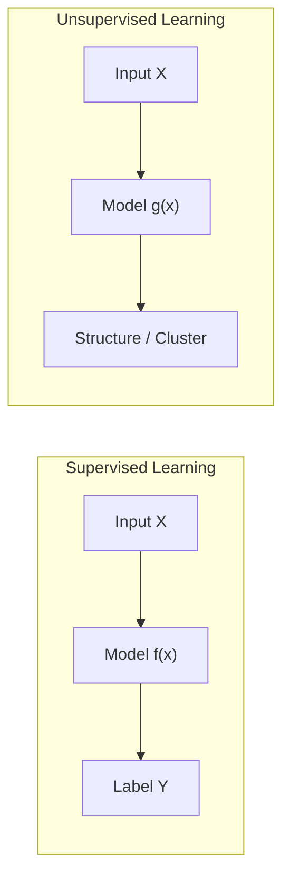
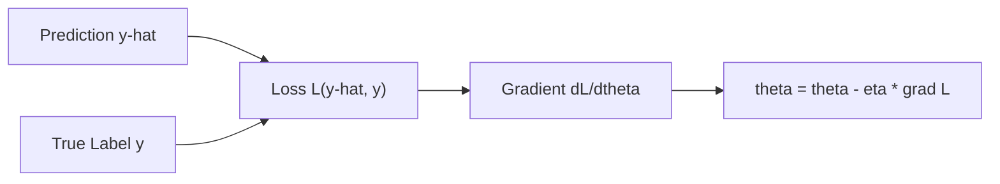
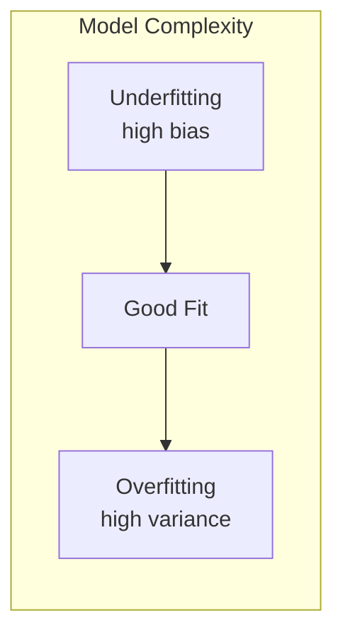
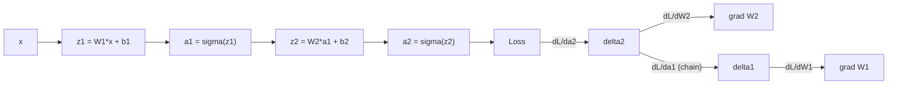
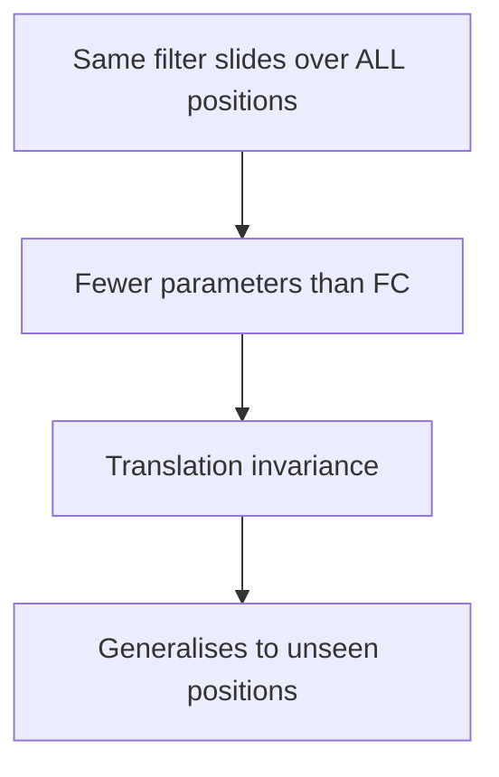

# Deep Learning — Test Answer Key

> **Format guide**: Diagrams → Mermaid | Math → LaTeX | Tables → Markdown

---

## SECTION A — 4 Marks

---

### A1 · Supervised vs Unsupervised Learning

| Feature | Supervised | Unsupervised |
|---|---|---|
| **Labels** | ✅ Required | ❌ None |
| **Goal** | Learn mapping $f: X \to Y$ | Discover hidden structure |
| **Output** | Class / Value | Cluster / Embedding |
| **Examples** | Image classification, Regression | K-Means, Autoencoders |



**Key equations**

$$\text{Supervised: } \hat{y} = f_\theta(x), \quad \mathcal{L}(\hat{y}, y)$$

$$\text{Unsupervised: minimise } \mathcal{L}(x, \hat{x}) \text{ or maximise cluster cohesion}$$

---

### A2 · Loss Functions

> A **loss function** $\mathcal{L}$ measures how far model predictions are from true values. Training minimises $\mathcal{L}$ via gradient descent.

| Name | Formula | Used For |
|---|---|---|
| **MSE** | $\mathcal{L} = \dfrac{1}{n}\sum_{i=1}^{n}(y_i - \hat{y}_i)^2$ | Regression |
| **Cross-Entropy** | $\mathcal{L} = -\sum_{c} y_c \log(\hat{y}_c)$ | Classification |



---

## SECTION B — 6 Marks

---

### B1 · Overfitting & Regularisation



| Symptom | Training Loss | Validation Loss |
|---|---|---|
| Underfitting | High | High |
| **Overfitting** | **Low** | **High** |
| Good Fit | Low | Low |

#### Technique 1 — L2 Regularisation (Weight Decay)

$$\mathcal{L}_{\text{reg}} = \mathcal{L} + \frac{\lambda}{2}\|\theta\|^2$$

- Penalises large weights → forces simpler model
- $\lambda$ controls strength

#### Technique 2 — Dropout

$$\tilde{h}_i = h_i \cdot \text{Bernoulli}(p) \quad \text{(during training)}$$

```
Hidden layer          Next layer
  h1  ──────────────►
  h2  ──── DROPPED ✗
  h3  ──────────────►  (activations)
  h4  ──── DROPPED ✗

  p = 0.5 → each neuron kept with probability 0.5
  At test time: all neurons active, weights scaled by p
```

---

### B2 · Backpropagation & Chain Rule

> **Backpropagation** efficiently computes the gradient of the loss for every parameter by applying the **chain rule** in reverse through the network.

#### Chain Rule (core idea)

$$\frac{\partial \mathcal{L}}{\partial w} = \frac{\partial \mathcal{L}}{\partial a} \cdot \frac{\partial a}{\partial z} \cdot \frac{\partial z}{\partial w}$$

where $z = wx + b$, $a = \sigma(z)$.

#### Forward & Backward Pass



| Step | Direction | Purpose |
|---|---|---|
| Forward Pass | x to y-hat | Compute predictions & loss |
| Backward Pass | y-hat to x | Compute gradients via chain rule |
| Update | — | theta = theta - eta * grad L |

**Why chain rule is essential**: Layers are composed functions. Without the chain rule there is no way to propagate error signals back through multiple non-linear transformations.

---

## SECTION C — 10 Marks

---

### C1 · CNN Pipeline for Image Classification


*Source: D2L.ai — LeNet-style CNN architecture (LeCun et al. 1998)*

#### Key Operations

| Operation | Formula / Description |
|---|---|
| Convolution | $(\mathbf{I} * \mathbf{K})_{i,j} = \sum_m \sum_n \mathbf{I}_{i+m,\, j+n} \cdot \mathbf{K}_{m,n}$ |
| Output size | $O = \dfrac{W - F + 2P}{S} + 1$ |
| Stride $S$ | Step size of filter movement |
| Padding $P$ | Zero-border added to preserve spatial size |
| Max Pooling | $y = \max(\text{patch})$ — reduces spatial dims |
| Flatten | Reshape feature maps to 1-D vector |
| FC + Softmax | $\hat{y}_c = \dfrac{e^{z_c}}{\sum_k e^{z_k}}$ |

#### Parameter Sharing (why CNNs work for images)



- **Local connectivity** — each neuron sees a small patch
- **Parameter sharing** — same weights detect the same feature anywhere
- **Hierarchical features** — early layers: edges → deeper layers: shapes → objects

---

### C2 · Transformer Architecture


*Source: D2L.ai — Transformer architecture (Vaswani et al. 2017, "Attention Is All You Need")*

#### Self-Attention

$$\text{Attention}(Q, K, V) = \text{softmax}\!\left(\frac{QK^\top}{\sqrt{d_k}}\right)V$$

| Symbol | Meaning |
|---|---|
| $Q$ | Query matrix ($n \times d_k$) |
| $K$ | Key matrix ($n \times d_k$) |
| $V$ | Value matrix ($n \times d_v$) |
| $d_k$ | Dimension of keys (scaling factor) |

#### Multi-Head Attention


*Source: D2L.ai — Multi-head attention mechanism*

$$\text{MultiHead}(Q,K,V) = \text{Concat}(\text{head}_1, \ldots, \text{head}_h)W^O$$

$$\text{head}_i = \text{Attention}(QW_i^Q,\; KW_i^K,\; VW_i^V)$$

- Each head attends to **different aspects** of the sequence (syntax, semantics, co-reference…)

#### Positional Encoding

$$PE_{(pos,\, 2i)} = \sin\!\left(\frac{pos}{10000^{2i/d}}\right), \quad PE_{(pos,\, 2i+1)} = \cos\!\left(\frac{pos}{10000^{2i/d}}\right)$$

- Adds order information to otherwise **position-agnostic** embeddings

#### Transformer vs RNN

| Feature | RNN / LSTM | Transformer |
|---|---|---|
| **Parallelism** | ❌ Sequential (time steps) | ✅ All positions at once |
| **Long-range deps** | ⚠️ Vanishing gradient | ✅ Direct attention |
| **Training speed** | Slow (no GPU parallelism) | Fast |
| **Context window** | Limited by memory | Fixed but large |
| **Complexity** | $O(n \cdot d^2)$ | $O(n^2 \cdot d)$ |

> **Why Transformers parallelise better**: every token attends to every other token simultaneously via matrix operations, whereas RNNs must process tokens one-by-one, creating a sequential bottleneck.

---

*Answer key compiled for Deep Learning exam revision — A4 hand-copy format.*
