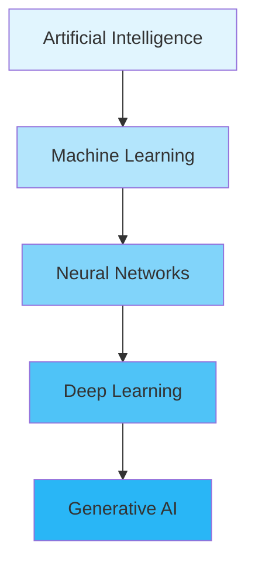
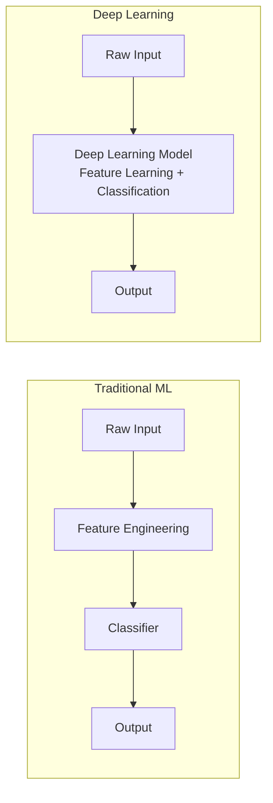

# Session 01 Visual Extraction Report
## Deep Learning Session 1 - 17th Nov

### Metadata
- **Video**: [Vimeo 1137772716](https://vimeo.com/1137772716)
- **Transcript**: session01_transcript.vtt
- **Duration**: ~1h42m
- **Instructors**: Prof. S R M Prasanna & Dr. Sunil Saumya (IIIT Dharwad)
- **Slide Deck ID**: 01DLPlan
- **Total Slides**: 21 (as per slide footer 12/21 visible)
- **Date**: November 17, 2025

---

### Visual Index

| ID | Timestamp | Slide Title | Type |
|----|-----------|-------------|------|
| V1 | 00:04:48 | Webcam only (intro/welcome) | No slide |
| V2 | 00:08:10 | Some Good Resources for DL | Book list |
| V3 | 00:13:11 | Topics to be Covered | Bullet list |
| V4 | 00:17:35 | Deep Learning Course Plan (Week 3-4) | Table |
| V5 | 00:24:08 | Deep Learning Course Plan (Week 9-14) | Table |
| V6 | 00:28:31 | History of Deep Learning | Bullet list |
| V7 | 00:34:00 | Artificial Intelligence | Bullet list |
| V8 | 00:38:39 | Machine Learning | Bullet list |
| V9 | 00:44:29 | Neural Nets vs Deep Learning | Bullet list |
| V10 | 01:00:32 | PyTorch Introduction | Bullet list |
| V11 | 01:12:11 | PyTorch vs TensorFlow | Comparison table |
| V12 | 01:17:55 | What are Tensors? | Diagram + text |
| V13 | 01:23:45 | Real-World Example: 1D Tensor | Diagram + text |

---

### Visual Reconstructions

#### V2: Some Good Resources for DL (00:08:10)

**Slide Content (Book List):**
- Duda and Hart, "Pattern Classification" Wiley, 2001
- C. M. Bishop, "Neural Networks for Pattern Recognition", 1995
- B. Yegnanarayana, "Artificial Neural Networks", PHI, 1999
- C. M. Bishop, "PRML", Springer, 2006
- Michael Nielsen "Neural Networks and Deep Learning" Open Book
- Ian Goodfellow, et al., "Deep Learning", MIT Press, 2016
- Charu Agarwal, "NNDL", Springer 2018
- Mithesh M. Khapra, "Deep Learning Part I and II" NPTEL Course
- Ali Ghodsi, "Deep Learning", University of Waterloo Course
- C. M. Bishop, "Deep Learning", 2024

---

#### V3: Topics to be Covered (00:13:11)

**Hands-on using PyTorch for:**
1. Neural networks
2. Deep feedforward neural networks
3. Convolutional neural networks
4. Recurrent neural networks and long short term memory (LSTM)
5. Transformers
6. Variational autoencoders
7. Generative adversarial networks (GANs)

---

#### V4: Deep Learning Course Plan Week 3-4 (00:17:35)

| Week | Session | Theory Topics | Hands-on Work |
|------|---------|---------------|---------------|
| 3 | 5 | CNN vs Other NNs; Convolution Basics; Filters; Feature Maps | Manual convolution; visualizing filters |
| 3 | 6 | CNN Modules: Pooling, Padding, Stride; CNN Training Pipeline | Train simple CNN |
| 4 | 7 | CNN as Feature Extractor; CNN as Classifier | Use pretrained CNN for feature extraction |
| 4 | 8 | Significance of CNNs in Object Classification Tasks | Error analysis, confusion matrix, Grad-CAM |

---

#### V5: Deep Learning Course Plan Week 9-14 (00:24:08)

| Week | Session | Theory Topics | Hands-on Work |
|------|---------|---------------|---------------|
| 9 | 17 | Transformer architecture (encoder/decoder blocks) | Mini Transformer encoder |
| 9 | 18 | Transformer training | Small Transformer training |
| 10 | 19 | Transformer applications (MT, QA, NER) | Fine-tune small Transformer |
| 10 | 20 | Attention variants (scaled dot-product, multi-head) | Attention visualization |
| 11 | 21 | Generative models (overview; Gen vs Disc) | Autoencoder demo |
| 11 | 22 | Variational Autoencoder (VAE) | VAE basic training |
| 12 | 23 | GAN fundamentals (generator, discriminator, minimax) | Simple GAN training |
| 12 | 24 | GAN extensions (CGAN applications) | CGAN basic run |
| 13 | - | Generative Pre-trained Transformers (GPT) | GPT text generation |
| 14 | - | Advanced topics / Code Demo | Revision lab / Presentation |

---

#### V6: History of Deep Learning (00:28:31)

**Key Points:**
- In 2006, Geoffrey Hinton et al. published a paper showing how to train a deep neural network capable of recognizing handwritten digits with state-of-the-art precision (>98%) and branded this technique "deep learning"
- Reference: Geoffrey E. Hinton et al., "A Fast Learning Algorithm for Deep Belief Nets", Neural Computation 18 (2006): 1527-1554
- A deep neural network is a (very) simplified computation model inspired by the structure and functioning of human brain, composed of layers of artificial neurons
- Training a deep neural net was widely considered impossible in the late 1990s and most researchers had abandoned the field
- Insufficient training data, limited computing power were the main challenges

---

#### V7: Artificial Intelligence (00:34:00)

**Slide Content:**
- **AI Definition**: Enabling machines to mimic so-called intelligent tasks performed by humans
  - Discovery, Learning, dealing with uncertainties and new situations
- **AI Categories** (John Haugeland, "Artificial Intelligence: The Very Idea", MIT Press, 1985):
  - Symbolic AI or Classical AI - knowledge representation by symbols and rules (NPTEL AI by Deepak Khemani)
  - Connectionist AI or DL based AI - sensing, modeling & classification
  - Hybrid of Symbolic & Connectionist AI - Interpretability & scalability

---

#### V8: Machine Learning (00:38:39)

**Slide Content:**
- With more digital data available, task of automatic discovery and learning of information (both natural and synthetic data)
- Not much focus on feature extraction, signal processing knowledge not pre-requisite
- More emphasis on discovery and learning of information by machine
- Ability to discover and learn from data (features)
- Treated learning more like associated function learning
- Given y is output and x is input data (features), learn f() which maps x to y

---

#### V9: Neural Nets vs Deep Learning (00:44:29)

**Slide Content:**
- The concept of deep learning first originated from neural network
- May be as advanced neural learning concept
- A good example of deep neural network is a deep feed forward neural network (DFFNN or DNN)
- Backpropagation (BP) is the workhorse algorithm for learning the parameters of FFNN
- BP did not work for networks having more than a small number of hidden layers
- Insufficient training data led to overfitting and difficulty in training of the deep learning model

---

#### V10: PyTorch Introduction (01:00:32)

**Slide Content:**
- Open-source deep learning library developed by Facebook AI Research (FAIR)
- Widely used for research and production due to dynamic computation graph and Pythonic design
- **Python and Torch - Brief History:**
  - Torch library originated at Idiap Research Institute at EPFL in Switzerland (2002)
  - Torch can perform tensor based operations on GPU
  - Torch has many Neural Network implementations
  - Limitation: Lua based programming language
- PyTorch is built on top of the original Torch library (Lua-based, 2002)
- In 2017, FAIR re-engineered Torch into Python, creating PyTorch with GPU acceleration

---

#### V11: PyTorch vs TensorFlow (01:12:11)

| Aspect | PyTorch | TensorFlow |
|--------|---------|------------|
| Execution Style | Dynamic graph (eager by default) | Static graph (TF1), eager + graph mode (TF2) |
| Ease of Use | Very Pythonic and intuitive | More structured, steeper learning curve |
| Debugging | Easy (behaves like normal Python code) | Harder due to graph abstraction |
| Research Adoption | Dominant choice for research papers | Less common in research now |
| Production Tools | Improving; TorchServe, ONNX support | Strong: TF-Serving, TF-Lite, TF.js |
| Ecosystem | TorchVision, TorchText, TorchAudio | TensorFlow Hub, TF-Addons, Keras |
| Hardware Support | Strong GPU support (NVIDIA focused) | Full support (GPU, TPU) |

**When to use what?**
- PyTorch: Research, experimentation, academic work, prototyping
- TensorFlow: Production deployment, mobile apps, TPUs, large-scale serving

---

#### V12: What are Tensors? (01:17:55)

**Tensors** are the fundamental data structure in PyTorch. They are generalizations of scalars, vectors, and matrices to higher dimensions.

```
Rank 0 Tensor = Scalar (e.g., 3.14)
Rank 1 Tensor = Vector (e.g., [0.12, -0.84, 0.33])
Rank 2 Tensor = Matrix (e.g., 28x28 grayscale image)
Rank 3 Tensor = 3D array (e.g., RGB image: 3 x H x W)
```

**Visual Representation (ASCII):**
```
[Rank 0]     [Rank 1]        [Rank 2]         [Rank 3]
  .          [----->]        [+--+--+]       [+--+--+]
 scalar       vector         |  |  |         |  |  | |
                             +--+--+         +--+--+ |
                             matrix           +--+--+
                                              3D cube
```

---

#### V13: Real-World Example - 1D Tensor (01:23:45)

**Vectors (1-dimensional tensors):**
- Represent a sequence or list of numbers
- Real-world uses: Word embedding vector, Sensor reading sequence
- Example: [0.12, -0.84, 0.33]

**Higher Dimension Examples (from lecture):**
- 2D Tensor: Grayscale image (28x28 MNIST digit)
- 3D Tensor: Color image (3 channels x H x W)
- 4D Tensor: Batch of images (batch_size x 3 x 224 x 224)
- 5D Tensor: Video clips (batch x frames x channels x H x W)

---

### Mermaid Reconstructions

#### AI > ML > DL > GenAI Hierarchy (discussed at ~46:00)



#### Course Flow (14 Weeks)

```mermaid
gantt
    title Deep Learning Course Plan (14 Weeks)
    dateFormat  X
    axisFormat %s
    section Foundation
    Neural Networks Intro     :a1, 1, 2
    Deep Feedforward NNs      :a2, 3, 4
    section CNN
    CNN Basics & Training     :a3, 5, 6
    CNN Applications          :a4, 7, 8
    section Sequence Models
    RNN & LSTM/GRU            :a5, 9, 10
    Seq2Seq & Attention       :a6, 11, 12
    section Transformers
    Transformer Architecture  :a7, 13, 14
    Transformer Training/Apps :a8, 15, 16
    section Genertic
    Attention Variants        :a9, 17, 18
    section Generative
    VAE & GAN                 :a10, 19, 22
    GPT                       :a11, 23, 24
    Advanced Topics           :a12, 25, 26
```



#### Traditional ML vs Deep Learning Pipeline



---

### Cross-Reference Matrix

| Visual | VTT Cues | Key Concept |
|--------|----------|-------------|
| V2 | 00:07:57-00:09:48 | Reference books for DL course |
| V3 | 00:12:05-00:13:40 | Course topics overview with PyTorch |
| V4-V5 | 00:14:04-00:26:00 | Detailed week-by-week course plan |
| V6 | 00:27:00-00:33:00 | Hinton 2006 paper, genesis of DL |
| V7 | 00:33:55-00:36:00 | AI definition and categories |
| V8 | 00:36:00-00:41:00 | ML as data-driven learning |
| V9 | 00:41:45-00:46:00 | NN vs DL, vanishing gradients |
| V10 | 00:57:02-01:07:00 | PyTorch intro, history from Torch |
| V11 | 01:07:00-01:15:00 | PyTorch vs TensorFlow comparison |
| V12-V13 | 01:17:00-01:32:00 | Tensors: 0D-5D, real-world uses |

---

### Summary

**Session 01** is the introductory lecture for the Deep Learning course (2nd semester). It covers:
1. **Course Plan**: 14-week structure covering NNs, CNNs, RNNs/LSTMs, Transformers, and Generative models (VAE, GAN, GPT) with 50% hands-on using PyTorch
2. **Evaluation**: Class notes (15%), X-factor (10%), Assignments (20%), Quiz (10%), Midterm (10%), End-term (35%)
3. **Genesis of DL**: Historical context from 1990s neural networks to Hinton's 2006 breakthrough paper on deep belief networks
4. **AI/ML/DL Hierarchy**: AI > ML > Neural Networks > Deep Learning > Generative AI
5. **Key Distinction**: Classical ML requires feature engineering; DL learns features directly from raw data
6. **PyTorch**: Open-source DL library by Meta/FAIR, built on Torch (2002), re-engineered in Python (2017), now dominant in research
7. **Tensors**: Fundamental data structure in PyTorch - generalizations from scalars (0D) to n-dimensional arrays, with GPU acceleration support

**Total Visuals Extracted**: 13 (V1-V13)
**Slide Deck**: 01DLPlan (21 slides)
