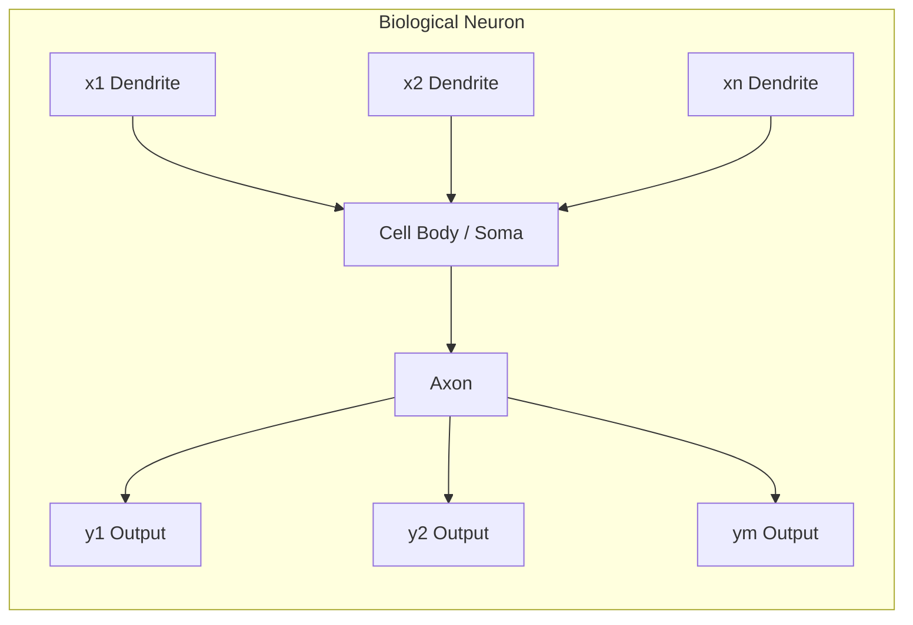

# Session 02: Visual Extraction Report

## Metadata
- **Session**: 02 (DL LS 2)
- **Vimeo URL**: https://vimeo.com/1139558263
- **Duration**: ~1:44:34
- **Instructors**: Dr. Sunil (PyTorch demo), Director/Prof (Neural Networks theory)
- **Topics**: PyTorch Tensor Basics (Colab demo), Biological & Artificial Neural Networks
- **VTT Source**: session02_transcript.vtt

---

## Visual Index

| Visual | VTT Cues | Key Content |
|--------|----------|-------------|
| V1 | 00:08:47 | Screen sharing begins |
| V2 | 00:13:45-00:14:17 | Slides: Tensors in forward/backward propagation |
| V3 | 00:15:34-00:16:58 | Google Colab: TensorBasics.ipynb opened |
| V4 | 00:17:27-00:18:30 | import torch, torch.__version__ (2.0.9.0) |
| V5 | 00:18:44-00:20:42 | torch.cuda.is_available() - CUDA check, GPU setup |
| V6 | 00:20:42-00:21:48 | Runtime changed to GPU (Tesla T4), CUDA available |
| V7 | 00:21:48-00:22:32 | Creating Tensor: torch.tensor([[1,2,3],[4,5,6]]) |
| V8 | 00:24:17-00:27:14 | torch.empty, torch.zeros, torch.ones (2x3) |
| V9 | 00:27:14-00:30:00 | torch.randn - random normal distribution |
| V10 | 00:30:00-00:34:00 | torch.manual_seed(10) - reproducibility demo |
| V11 | 00:34:56-00:36:44 | torch.arange, torch.linspace functions |
| V12 | 00:36:44-00:38:00 | torch.eye(5), torch.full(2,3,fill_value=5) |
| V13 | 00:39:50-00:46:00 | Shape, dtype, type casting demo |
| V14 | 00:47:05-00:55:00 | Math ops: element-wise add, multiply, subtract, divide |
| V15 | 00:55:00-01:01:00 | Matrix multiplication, dot product, comparison ops |
| V16 | 01:01:00-01:07:00 | Log, exp, abs, neg, round, ceil, floor, reduction ops |
| V17 | 01:07:06-01:08:25 | In-place operations: m.add_(n) |
| V18 | 01:08:25-01:10:57 | GPU vs CPU benchmark code |
| V19 | 01:10:57-01:11:44 | Results: CPU 25.7s vs GPU 0.4s |
| V20 | 01:11:44-01:13:30 | Reshape with .view(): 1D to 3x4, 2x6, 6x2, 12x1 |
| V21 | 01:19:17-01:22:10 | Slide: Human Brain anatomy diagram |
| V22 | 01:22:10-01:27:25 | Slide: Features of Biological Neural Networks |
| V23 | 01:27:25-01:31:49 | Slide: Biological Neuron structure and function |
| V24 | 01:31:49-01:42:00 | Slide: Biological Neuron + Artificial Neuron model |

---

## Visual Reconstructions

### V3: Google Colab - TensorBasics.ipynb (00:15:34)

```
+----------------------------------------------------------+
| TensorBasics.ipynb          [Connect] [T4 (Python 3)]    |
|----------------------------------------------------------|
| + Code  + Text  > Run all                                |
|----------------------------------------------------------|
| [ ] Start coding or generate with AI.                    |
|                                                          |
| [What can I help you build?]                             |
+----------------------------------------------------------+
```

### V4-V6: PyTorch Setup & CUDA Check (00:17:27-00:21:48)

```python
# Cell 1: Import PyTorch
import torch
print(torch.__version__)  # Output: 2.0.9.0

# Cell 2: CUDA Availability Check
if torch.cuda.is_available():
    print("cuda is available")
else:
    print("cuda is not available")
# Initially: "cuda is not available" (CPU runtime)
# After runtime change to GPU: "cuda is available"
# GPU: Tesla T4
```

### V7-V8: Creating Tensors (00:21:48-00:27:14)

```python
# Creating tensor manually
a = torch.tensor([[1,2,3],[4,5,6]])
print(a)
# tensor([[1, 2, 3],
#         [4, 5, 6]])

# Empty tensor (uninitialized - garbage values)
b = torch.empty(2,3)  # 2 rows, 3 cols with random memory values

# Zeros tensor
c = torch.zeros(2,3)  # All zeros

# Ones tensor
d = torch.ones(2,3)   # All ones
```

### V9-V10: Random Tensors & Manual Seed (00:27:14-00:34:00)

```python
# Random normal distribution (mean=0, std=1)
e = torch.randn(2,3)  # Values between 0 and 1

# Without seed: different values each run
# With manual seed: reproducible results
torch.manual_seed(10)
f1 = torch.randn(2,3)  # Same output every time with seed=10
torch.manual_seed(10)
f2 = torch.randn(2,3)  # f1 == f2 (identical)
```

### V11-V12: Arange, Linspace, Eye, Full (00:34:56-00:38:00)

```python
# Arange: start, stop, step
torch.arange(0, 10, 1)   # tensor([0,1,2,3,4,5,6,7,8,9])
torch.arange(0, 10, 2)   # tensor([0,2,4,6,8])

# Linspace: linearly spaced values
torch.linspace(0, 10, 5)  # tensor([0.0, 2.5, 5.0, 7.5, 10.0])
torch.linspace(0, 10, 10) # 10 equally spaced values

# Identity matrix
torch.eye(5)  # 5x5 identity matrix

# Full tensor
torch.full((2,3), fill_value=5)  # 2x3 tensor filled with 5
```

### V14-V15: Mathematical Operations (00:47:05-01:01:00)

```python
# Element-wise operations
x + y    # Addition
x * y    # Multiplication
x - y    # Subtraction
x / y    # Division
x // y   # Floor division
x % y    # Modulus

# Matrix multiplication (requires compatible shapes)
torch.matmul(a, b)  # a: 2x3, b must be 3xN
# Error if shapes incompatible (e.g., 2x3 @ 2x3)

# Comparison operations
a > b    # Element-wise boolean
a == b   # Element-wise equality
```

### V17: In-Place Operations (01:07:06)

```python
# Standard: creates new tensor (extra memory)
s = m + n  # m unchanged, new tensor s created

# In-place: modifies m directly (saves memory)
m.add_(n)  # Underscore suffix = in-place operation
# Now m contains m+n, original m values overwritten
# Critical for large neural networks with millions of weights
```

### V18-V19: GPU vs CPU Benchmark (01:08:25-01:10:57)

```python
# 10000x10000 matrix multiplication comparison
# CUDA Available: True
# GPU Device: Tesla T4

# === CPU Computation ===
# Device for W: cpu
# Device for X: cpu
# CPU Time: 25.714366 seconds

# === GPU Computation ===
# Device for W_gpu: cuda:0
# Device for X_gpu: cuda:0
# GPU Time: 0.400103 seconds
# ~64x speedup with GPU
```

### V20: Reshape with .view() (01:11:44)

```python
t = torch.arange(0, 12, 1)  # tensor([0,1,2,...,11])
t.view(3, 4)   # 3 rows x 4 cols
t.view(2, 6)   # 2 rows x 6 cols
t.view(6, 2)   # 6 rows x 2 cols
t.view(12, 1)  # 12 rows x 1 col (column vector)
t.view(6, 3)   # ERROR: invalid for input size 12
```

### V21: Human Brain Anatomy Slide (01:19:17-01:22:10)

```
+------------------------------------------------------+
|              Human Brain                             |
|------------------------------------------------------|
|  [Labeled brain diagram showing:]                    |
|  - Motor Cortex (Movement)                           |
|  - Central Sulcus                                    |
|  - Sensory Cortex (Pain, heat, sensations)           |
|  - Frontal Lobe (Judgment, foresight)                |
|  - Parietal Lobe (Comprehension of language)         |
|  - Broca's Area (Speech)                             |
|  - Temporal Lobe (Hearing)                           |
|  - Occipital Lobe (Primary visual area)              |
|  - Wernicke's Area                                   |
|  - Brainstem (Swallowing, breathing, heartbeat)      |
|  Ref: https://www.jworldtimes.com                    |
+------------------------------------------------------+
```

### V22: Features of Biological Neural Networks (01:22:10-01:27:25)

```
+------------------------------------------------------+
| Features of Biological Neural Networks               |
|------------------------------------------------------|
| * Robustness and fault tolerance:                    |
|   Decay of nerve cells does not affect performance   |
| * Flexibility:                                       |
|   Adjusts to new environment automatically           |
| * Variety of data:                                   |
|   Deals with fuzzy, probabilistic, noisy data        |
| * Collective computation:                            |
|   Performs routinely in parallel and distributed      |
+------------------------------------------------------+
```

### V23-V24: Biological & Artificial Neuron (01:27:25-01:42:00)



```
  Artificial Neuron (Computational Model)
  ========================================
  
  in_1 --w1--> [  Sigma  ] --> [ f ] --> out
  in_2 --w2-->    (Sum)        (Activation)
  ...          - theta
  in_n --wn-->   (Bias)
  
  Activation = (w1*in1 + w2*in2 + ... + wn*inn) - theta
  Output = f(Activation)  where f = nonlinear function
  
  Key mappings:
  - Dendrites    -> Inputs (in_1...in_n)
  - Synaptic wt  -> Link weights (w1...wn)
  - Cell body    -> Summation (Sigma)
  - Threshold    -> Bias (theta)
  - Firing       -> Activation function (f)
  - Axon output  -> Output (out)
```

Ref: https://en.wikipedia.org/wiki/Biological_neuron_model

---

### Cross-Reference Matrix

| Visual | VTT Cues | Key Coverage |
|--------|----------|-------------|
| V1 | 00:08:47 | Instructor shares screen |
| V2 | 00:13:45-00:14:17 | Recap slide: tensors in DL pipelines |
| V3 | 00:15:34-00:16:58 | Colab notebook creation |
| V4-V6 | 00:17:27-00:21:48 | PyTorch import, version, CUDA setup |
| V7-V8 | 00:21:48-00:27:14 | Tensor creation methods |
| V9-V10 | 00:27:14-00:34:00 | Random tensors, reproducibility |
| V11-V12 | 00:34:56-00:38:00 | Range and utility tensor functions |
| V13 | 00:39:50-00:46:00 | Shape, dtype, type casting |
| V14-V16 | 00:47:05-01:07:00 | All mathematical & reduction ops |
| V17 | 01:07:06-01:08:25 | In-place operations |
| V18-V19 | 01:08:25-01:11:44 | GPU vs CPU benchmark |
| V20 | 01:11:44-01:13:30 | Tensor reshaping |
| V21-V24 | 01:19:17-01:42:00 | Neural network theory slides |

---

### Summary

**Session 02** covers two main parts:

1. **PyTorch Tensor Basics (Colab Demo)**: Hands-on demonstration covering tensor creation (manual, empty, zeros, ones, random, arange, linspace, eye, full), manual seed for reproducibility, shape/dtype inspection, element-wise and matrix operations, special functions (log, exp, abs, round, ceil, floor), reduction operations (sum, mean, median, max, min), in-place operations with underscore suffix, GPU vs CPU performance benchmark showing ~64x speedup (25.7s vs 0.4s on Tesla T4 for 10000x10000 matmul), and tensor reshaping with .view().

2. **Neural Networks Introduction (Theory Slides)**: Overview of biological neural networks as inspiration for computational models - covering human brain structure (layered organization, parallel distributed processing), features (robustness, flexibility, noise tolerance), biological neuron anatomy (dendrites, soma, axon, synaptic junctions, myelin sheath), and the mapping to artificial neuron model (inputs, weights, summation, bias/threshold, activation function, output).
