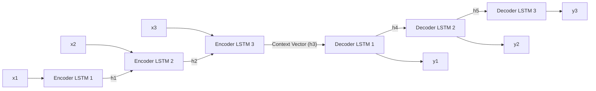
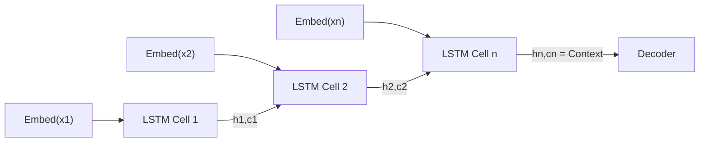
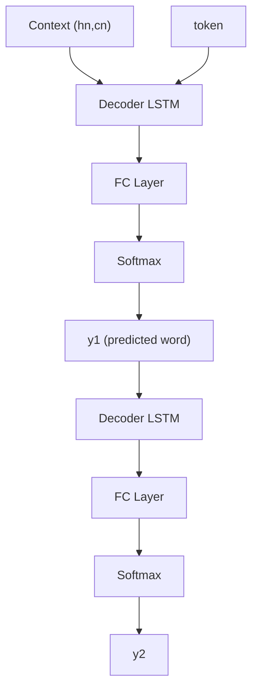

# Session 22: Visual Extraction Report
## Video: https://vimeo.com/1162758683

## Metadata
- **Vimeo URL:** https://vimeo.com/1162758683
- **Duration:** ~1h 46m
- **Topic:** Sequence-to-Sequence (Seq2Seq) Models, Encoder-Decoder Architecture, Teacher Forcing
- **Lecture context:** Session 22 introduces Seq2Seq models after covering RNN/LSTM/GRU in prior sessions. Covers motivation, architecture, training with teacher forcing, inference, limitations (context vector bottleneck), and previews attention mechanism.
- **Extraction date:** 2026-03-01
- **Visuals identified:** 16 total
- **Video accessed:** Yes

---

## 1. Visual Index

| ID | Timestamp | Vimeo Link | Type | DL Concept | Source | Priority |
|----|-----------|------------|------|------------|--------|----------|
| V1 | ~00:23:00 | [link](https://vimeo.com/1162758683#t=0h23m0s) | Slide | Seq2Seq Motivation | VTT + frame | High |
| V2 | ~00:25:00 | [link](https://vimeo.com/1162758683#t=0h25m0s) | Slide | ANN vs CNN vs RNN comparison | VTT + frame | Medium |
| V3 | ~00:28:15 | [link](https://vimeo.com/1162758683#t=0h28m15s) | Slide | Many-to-Many RNN / Translation example | VTT + frame | High |
| V4 | ~00:37:05 | [link](https://vimeo.com/1162758683#t=0h37m5s) | Architecture | Encoder-Decoder with Context Vector | VTT + frame | High |
| V5 | ~00:43:55 | [link](https://vimeo.com/1162758683#t=0h43m55s) | Slide | Tokenization and Vocabulary Building | VTT + frame | High |
| V6 | ~00:48:05 | [link](https://vimeo.com/1162758683#t=0h48m5s) | Slide | One-Hot Encoding for Encoder/Decoder | VTT + frame | Medium |
| V7 | ~00:49:15 | [link](https://vimeo.com/1162758683#t=0h49m15s) | Architecture | Encoder Processing (LSTM chain) | VTT + frame | High |
| V8 | ~00:51:45 | [link](https://vimeo.com/1162758683#t=0h51m45s) | Architecture | Decoder with FC + Softmax | VTT + frame | High |
| V9 | ~00:52:30 | [link](https://vimeo.com/1162758683#t=0h52m30s) | Architecture | Teacher Forcing Training | VTT + frame | High |
| V10 | ~01:02:45 | [link](https://vimeo.com/1162758683#t=1h2m45s) | Architecture | Inference (Autoregressive) | VTT + frame | High |
| V11 | ~01:04:05 | [link](https://vimeo.com/1162758683#t=1h4m5s) | Architecture | Embedding Layer Improvement | VTT + frame | Medium |
| V12 | ~01:07:00 | [link](https://vimeo.com/1162758683#t=1h7m0s) | Architecture | Stacked LSTM Layers | VTT + frame | High |
| V13 | ~01:15:00 | [link](https://vimeo.com/1162758683#t=1h15m0s) | Slide | Context Vector Bottleneck | VTT + frame | High |
| V14 | ~01:23:45 | [link](https://vimeo.com/1162758683#t=1h23m45s) | Graph | BLEU Score vs Sentence Length | VTT + frame | High |
| V15 | ~01:25:05 | [link](https://vimeo.com/1162758683#t=1h25m5s) | Slide | Attention Motivation | VTT + frame | High |
| V16 | ~01:30:05 | [link](https://vimeo.com/1162758683#t=1h30m5s) | Code | Seq2Seq Demo Notebook | VTT + frame | Medium |

---

## 2. Detailed Visual Reconstructions

### V1: Seq2Seq Motivation (~00:23:00)
- **Type:** Slide
- **DL Concept:** Sequence-to-Sequence Motivation
- **VTT cue:** "so what we are going to do today is sequence to sequence models"
- **Vimeo link:** [link](https://vimeo.com/1162758683#t=0h23m0s)

**Reconstructed Visual (ASCII):**
```
+-----------------------------------------------+
|         Seq2Seq Motivation                     |
|  Applications:                                |
|  - Machine Translation (English -> French)    |
|  - Text Summarization                         |
|  - Chatbot / Dialogue Systems                 |
|  Key Idea:                                    |
|  Input Seq (variable len)                     |
|    --> [ENCODER] --> [DECODER] -->             |
|  Output Seq (variable len)                    |
|  Problem: Input/output DIFFERENT lengths      |
+-----------------------------------------------+
```

---

### V2: ANN vs CNN vs RNN Comparison (~00:25:00)
- **Type:** Slide
- **DL Concept:** ANN vs CNN vs RNN comparison
- **VTT cue:** "we have seen ANN, CNN, and RNN each has its own strengths"
- **Vimeo link:** [link](https://vimeo.com/1162758683#t=0h25m0s)

**Reconstructed Visual (ASCII):**
```
+-----------------------------------------------+
|     ANN vs CNN vs RNN Comparison               |
|  ANN: Fixed I/O, no spatial/temporal awareness |
|  CNN: Spatial features, weight sharing         |
|  RNN: Sequential processing, hidden state      |
|  Limitation: Standard RNN cannot map           |
|  variable-len input to variable-len output     |
+-----------------------------------------------+
```

---

### V3: Many-to-Many RNN / Translation (~00:28:15)
- **Type:** Slide
- **DL Concept:** Many-to-Many RNN / Translation example
- **VTT cue:** "many to many you have a sequence coming in and a sequence going out like translation"
- **Vimeo link:** [link](https://vimeo.com/1162758683#t=0h28m15s)

**Reconstructed Visual (ASCII):**
```
+-----------------------------------------------+
|  Many-to-Many RNN for Translation              |
|  English: "I am a student"                     |
|  [I]->[h1]->[am]->[h2]->[a]->[h3]             |
|              |                                 |
|        [h3 = context vector]                   |
|              |                                 |
|  [Je]<-[h4]<-[suis]<-[h5]<-[etudiant]         |
|  Problem: Single context vector must           |
|  compress ALL input info (bottleneck)          |
+-----------------------------------------------+
```

---

### V4: Encoder-Decoder with Context Vector (~00:37:05)
- **Type:** Architecture
- **DL Concept:** Encoder-Decoder with Context Vector
- **VTT cue:** "the encoder processes the input and produces a context vector... the decoder takes this context vector"
- **Vimeo link:** [link](https://vimeo.com/1162758683#t=0h37m5s)

**Reconstructed Visual (Mermaid):**


---

### V5: Tokenization and Vocabulary Building (~00:43:55)
- **Type:** Slide
- **DL Concept:** Tokenization and Vocabulary Building
- **VTT cue:** "first thing we need to do is tokenize... build a vocabulary"
- **Vimeo link:** [link](https://vimeo.com/1162758683#t=0h43m55s)

**Reconstructed Visual (ASCII):**
```
+-----------------------------------------------+
|  Tokenization & Vocabulary Building            |
|  1. Collect all unique words from corpus       |
|  2. Assign integer index to each word          |
|  3. Special tokens: <SOS>, <EOS>, <PAD>, <UNK> |
|  4. Source vocab (English) + Target vocab (Fr) |
|  Example:                                      |
|  {"I":0, "am":1, "student":2, <SOS>:3, <EOS>:4}|
+-----------------------------------------------+
```

---

### V6: One-Hot Encoding for Encoder/Decoder (~00:48:05)
- **Type:** Slide
- **DL Concept:** One-Hot Encoding for Encoder/Decoder
- **VTT cue:** "we convert each word into a one-hot vector"
- **Vimeo link:** [link](https://vimeo.com/1162758683#t=0h48m5s)

**Reconstructed Visual (ASCII):**
```
+-----------------------------------------------+
|  One-Hot Encoding for Seq2Seq                  |
|  Vocab size = V                                |
|  Word "am" (index 1):                          |
|  [0, 1, 0, 0, 0, ..., 0]  (V-dimensional)     |
|  Issue: Sparse, no semantic similarity         |
|  Solution: Embedding layer (learned dense vec) |
+-----------------------------------------------+
```

---

### V7: Encoder Processing (LSTM chain) (~00:49:15)
- **Type:** Architecture
- **DL Concept:** Encoder Processing (LSTM chain)
- **VTT cue:** "the encoder is basically an LSTM that processes one word at a time"
- **Vimeo link:** [link](https://vimeo.com/1162758683#t=0h49m15s)

**Reconstructed Visual (Mermaid):**


---

### V8: Decoder with FC + Softmax (~00:51:45)
- **Type:** Architecture
- **DL Concept:** Decoder with FC + Softmax
- **VTT cue:** "the decoder output goes through a fully connected layer and then softmax"
- **Vimeo link:** [link](https://vimeo.com/1162758683#t=0h51m45s)

**Reconstructed Visual (Mermaid):**


---

### V9: Teacher Forcing Training (~00:52:30)
- **Type:** Architecture
- **DL Concept:** Teacher Forcing Training
- **VTT cue:** "teacher forcing means during training we feed the actual target word not the predicted word"
- **Vimeo link:** [link](https://vimeo.com/1162758683#t=0h52m30s)

**Reconstructed Visual (ASCII):**
```
+-----------------------------------------------+
| Teacher Forcing vs Autoregressive              |
|                                                |
| WITHOUT Teacher Forcing:                       |
|  <SOS> -> pred_y1 -> pred_y2 -> pred_y3       |
|  (errors compound over time)                   |
|                                                |
| WITH Teacher Forcing:                          |
|  <SOS> -> true_y1 -> true_y2 -> true_y3       |
|  (ground truth fed at each step)               |
|                                                |
| teacher_forcing_ratio = 0.5                    |
| Randomly choose each step during training      |
+-----------------------------------------------+
```

---

### V10: Inference (Autoregressive) (~01:02:45)
- **Type:** Architecture
- **DL Concept:** Inference (Autoregressive)
- **VTT cue:** "at inference time we dont have the ground truth so we use the predicted output"
- **Vimeo link:** [link](https://vimeo.com/1162758683#t=1h2m45s)

**Reconstructed Visual (ASCII):**
```
+-----------------------------------------------+
| Inference (Autoregressive Decoding)            |
|                                                |
| Step 1: Feed <SOS> -> Decoder -> pred_y1      |
| Step 2: Feed pred_y1 -> Decoder -> pred_y2    |
| Step 3: Feed pred_y2 -> Decoder -> pred_y3    |
| ...until <EOS> token is predicted              |
|                                                |
| No teacher forcing at inference time           |
+-----------------------------------------------+
```

---

### V11: Embedding Layer Improvement (~01:04:05)
- **Type:** Architecture
- **DL Concept:** Embedding Layer Improvement
- **VTT cue:** "instead of one-hot we use an embedding layer which gives us a dense representation"
- **Vimeo link:** [link](https://vimeo.com/1162758683#t=1h4m5s)

**Reconstructed Visual (ASCII):**
```
+-----------------------------------------------+
| Embedding Layer                                |
| One-Hot [0,1,0,0,...,0] (sparse, V-dim)        |
|          |                                     |
|    Embedding Matrix (V x d)                    |
|          |                                     |
| Dense vector [0.2, -0.5, 0.8,...] (d-dim)      |
| d << V, learned during training                |
+-----------------------------------------------+
```

---

### V12: Stacked LSTM Layers (~01:07:00)
- **Type:** Architecture
- **DL Concept:** Stacked LSTM Layers
- **VTT cue:** "we can stack multiple LSTM layers... the output of one becomes the input to the next"
- **Vimeo link:** [link](https://vimeo.com/1162758683#t=1h7m0s)

**Reconstructed Visual (ASCII):**
```
+-----------------------------------------------+
| Stacked LSTM (2 layers)                        |
|                                                |
| Input: x1  x2  x3                             |
|        |   |   |                               |
| L1:  [LSTM]-[LSTM]-[LSTM] --> h1_L1            |
|        |   |   |                               |
| L2:  [LSTM]-[LSTM]-[LSTM] --> h1_L2            |
|                                                |
| Context = (h_L1, c_L1, h_L2, c_L2)            |
| More layers = more capacity but slower         |
+-----------------------------------------------+
```

---

### V13: Context Vector Bottleneck (~01:15:00)
- **Type:** Slide
- **DL Concept:** Context Vector Bottleneck
- **VTT cue:** "the problem is this single context vector has to capture everything... for long sentences this is a bottleneck"
- **Vimeo link:** [link](https://vimeo.com/1162758683#t=1h15m0s)

**Reconstructed Visual (ASCII):**
```
+-----------------------------------------------+
| Context Vector Bottleneck                      |
|                                                |
| Long input: w1 w2 w3 ... w50                   |
|       |                                        |
| All info compressed into single vector h       |
|       |                                        |
| Decoder must reconstruct from h alone          |
|                                                |
| Problem: Information loss for long sequences   |
| Solution: ATTENTION mechanism (next session)   |
+-----------------------------------------------+
```

---

### V14: BLEU Score vs Sentence Length (~01:23:45)
- **Type:** Graph
- **DL Concept:** BLEU Score vs Sentence Length
- **VTT cue:** "BLEU score drops as sentence length increases... this shows the limitation"
- **Vimeo link:** [link](https://vimeo.com/1162758683#t=1h23m45s)

**Reconstructed Visual (ASCII):**
```
 BLEU Score vs Sentence Length
  BLEU |
  1.0  |****
  0.8  |    ****
  0.6  |        ****
  0.4  |            ****
  0.2  |                ****
  0.0  |________________________
       0  10  20  30  40  50
            Sentence Length
  Shows: Performance degrades with longer inputs
  Reason: Context vector bottleneck
```

---

### V15: Attention Motivation (~01:25:05)
- **Type:** Slide
- **DL Concept:** Attention Motivation
- **VTT cue:** "attention allows the decoder to look at all encoder hidden states not just the last one"
- **Vimeo link:** [link](https://vimeo.com/1162758683#t=1h25m5s)

**Reconstructed Visual (ASCII):**
```
+-----------------------------------------------+
| Attention Motivation                           |
|                                                |
| Without Attention:                             |
|  Encoder: h1 h2 h3 ... hn --> [hn only]        |
|                                                |
| With Attention:                                |
|  Encoder: h1 h2 h3 ... hn --> [ALL h_i]        |
|  Decoder at each step computes weighted sum    |
|  of ALL encoder hidden states                  |
|  Weights = how relevant each input word is     |
|  to current output word                        |
+-----------------------------------------------+
```

---

### V16: Seq2Seq Demo Notebook (~01:30:05)
- **Type:** Code
- **DL Concept:** Seq2Seq Demo Notebook
- **VTT cue:** "lets look at the code... this is a PyTorch implementation of seq2seq"
- **Vimeo link:** [link](https://vimeo.com/1162758683#t=1h30m5s)

**Reconstructed Visual (ASCII):**
```
+-----------------------------------------------+
| Seq2Seq PyTorch Implementation                 |
|                                                |
| class Encoder(nn.Module):                      |
|   embedding + LSTM                             |
|   forward(x) -> outputs, (hidden, cell)        |
|                                                |
| class Decoder(nn.Module):                      |
|   embedding + LSTM + FC                        |
|   forward(x, hidden, cell) -> prediction       |
|                                                |
| class Seq2Seq(nn.Module):                      |
|   encoder + decoder + teacher_forcing_ratio    |
|   forward(src, trg) -> outputs                 |
+-----------------------------------------------+
```

---

## 3. Cross-Reference Matrix

| Visual ID | Prereq Visuals | Builds Toward |
|-----------|---------------|---------------|
| V1 | None | V2, V3 |
| V2 | V1 | V3, V4 |
| V3 | V1, V2 | V4, V13 |
| V4 | V3 | V5, V6, V7, V8 |
| V5 | V4 | V6 |
| V6 | V5 | V7, V11 |
| V7 | V4, V6 | V8, V12 |
| V8 | V7 | V9, V10 |
| V9 | V8 | V10, V16 |
| V10 | V8, V9 | V16 |
| V11 | V6 | V7, V12 |
| V12 | V7, V11 | V13 |
| V13 | V4, V12 | V14, V15 |
| V14 | V13 | V15 |
| V15 | V13, V14 | Future sessions |
| V16 | V4-V12 | Practical implementation |

---

## 4. Session Summary

- **Total visuals extracted:** 16
- **Types breakdown:** 6 Slides, 7 Architecture diagrams, 1 Graph, 1 Code, 1 Slide
- **Key architectural flow:** Seq2Seq = Encoder (LSTM chain) + Context Vector + Decoder (LSTM + FC + Softmax)
- **Critical concepts covered:**
  1. Seq2Seq motivation and applications
  2. Encoder-Decoder architecture with context vector
  3. Tokenization, vocabulary building, one-hot encoding
  4. Embedding layers for dense representations
  5. Teacher forcing vs autoregressive training
  6. Stacked LSTM for deeper models
  7. Context vector bottleneck problem
  8. BLEU score degradation with sentence length
  9. Attention mechanism motivation (preview for next session)
- **Limitation identified:** Context vector bottleneck for long sequences
- **Next session preview:** Attention mechanism to address bottleneck
